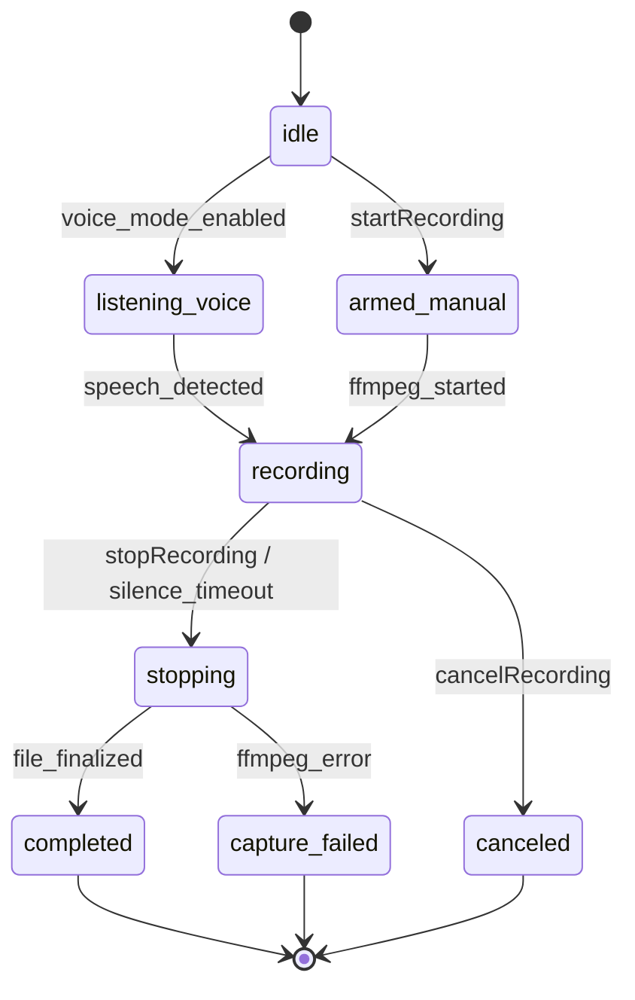
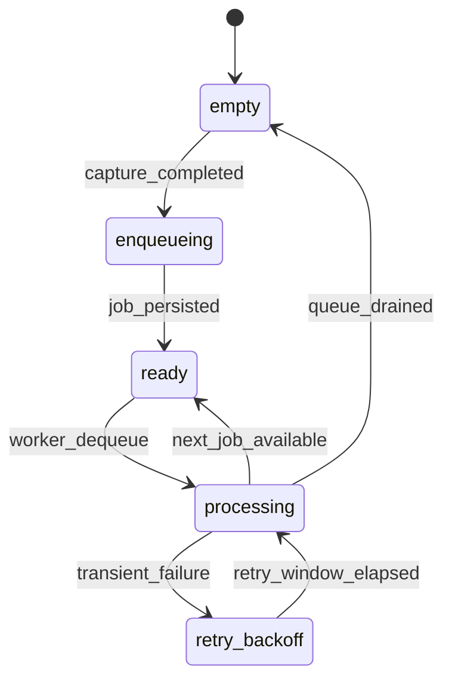
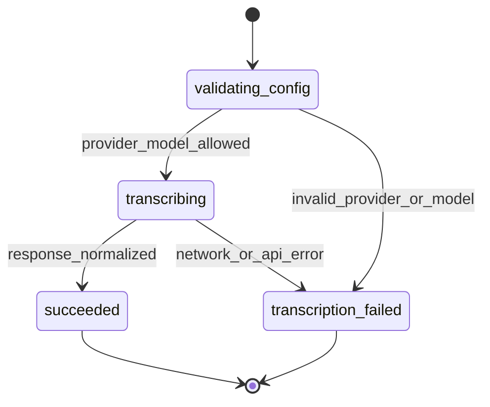
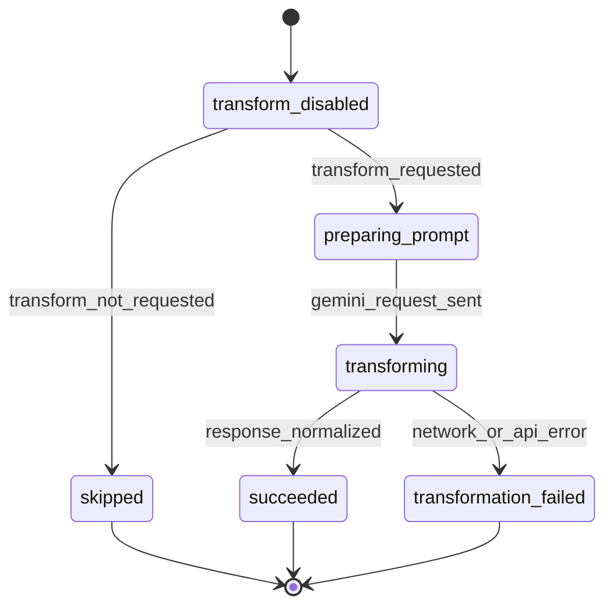
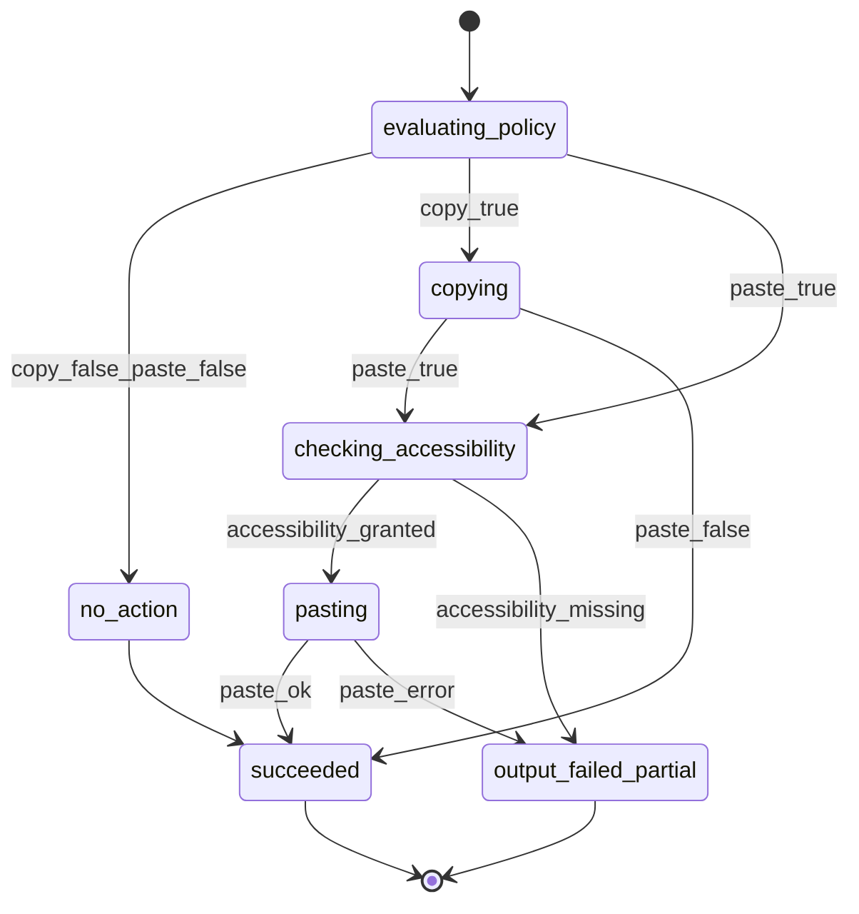

<!--
Where: specs/ARCTECTURE.md
What: Detailed v1 architecture and dependency specification for the macOS speech-to-text app.
Why: Turn product/user-flow requirements into a build-ready technical contract with clear module boundaries and external integrations.
-->

# Speech-to-Text App v1 Architecture Spec

## 1. Query Breakdown and Intent Analysis

Input request interpreted:
- "Create an architecture overview and dependencies we'll use"
- "Break down and analyze the query until you're confident about what it might be asking"
- "Create a detailed spec file in md"

What this appears to ask for:
- A new architecture document derived from `specs/v1-spec.md`.
- A clear dependency plan (runtime, external services, tooling).
- A detailed implementation spec (not just a high-level summary).

Confidence level:
- High (~90%) that this file should define v1 technical architecture and dependency contracts.

Assumptions used:
- `specs/v1-spec.md` remains the product/behavior source of truth.
- This document should be implementation-facing and actionable for coding.
- Stack directive is `Electron + Electron Vite + Electron Builder`.
- We should keep dependencies minimal beyond the required Electron toolchain.

## 2. Scope and Authority

This document translates v1 product requirements into implementation architecture.

Authoritative upstream documents:
- `specs/v1-spec.md` for scope, behavior, external API allowlists, and acceptance tests.
- `specs/user-flow.md` for user-observable interaction outcomes.

If conflicts occur:
- Behavioral outcomes follow `specs/user-flow.md`.
- Provider/model allowlists and settings contract follow `specs/v1-spec.md`.

## 3. Architecture Overview

Architecture style:
- Electron desktop app with explicit `main`/`preload`/`renderer` boundaries and a serialized processing queue.
- Event-driven workflow from global shortcut to captured audio to processed output.
- Explicit terminal state for every completed recording job.

High-level components:
1. Main Process Layer (privileged runtime)
- `AppLifecycle` (boot, single instance, login startup)
- `WindowManager` (`MainWindow`, tray/menu bar behavior)
- `ShortcutManager` (global shortcuts)
- `RecordingOrchestrator`
- `ProcessingOrchestrator`
- Main-process owned services requiring OS access

2. Preload Layer (secure bridge)
- `contextBridge` surface only
- Typed IPC API for settings, recording commands, history queries, and transform actions
- No raw `ipcRenderer` exposure in renderer code

3. Renderer Layer (UI)
- `SettingsView`
- `HistoryView`
- Standard app UI
- Menu bar utility UI shell

4. Service Layer (main-process owned)
- `HotkeyService`
- `CaptureService`
- `JobQueueService` (single serialized worker)
- `TranscriptionService` (Groq/ElevenLabs adapters)
- `TransformationService` (Gemini adapter)
- `OutputService` (copy/paste matrix)
- `HistoryService`
- `PermissionService`
- `SecretStore`
- `NetworkCompatibilityService`

5. Infrastructure Layer
- `FFmpegRunner` (safe process wrapper)
- `HTTPClient` (Node/Electron networking, retry policy)
- `KeychainClient`
- `ClipboardClient`
- `PasteAutomationClient`
- `Logger`

## 4. Data Flow and State Model

### 4.1 Recording Command Flow

1. Global shortcut triggers command (`start`, `stop`, `toggle`, `cancel`).
2. `RecordingOrchestrator` validates permissions and mode.
3. `CaptureService` starts/stops FFmpeg capture session.
4. Completed capture emits `CaptureCompleted(audioFileURL, metadata)`.
5. `JobQueueService` persists journal record (`atomic write + fsync`) before enqueue acknowledgment.

### 4.2 Processing Job Flow

1. Queue worker dequeues one job.
2. `TranscriptionService` calls selected STT provider.
3. If transform enabled, `TransformationService` calls Gemini.
4. `OutputService` applies output matrix per output type.
5. `HistoryService` persists result and terminal status.

### 4.3 Job State Machine (Canonical)

Processing states:
- `queued`
- `transcribing`
- `transforming` (optional)
- `applying_output`

Terminal statuses (single source of truth):
- `succeeded`
- `capture_failed`
- `transcription_failed`
- `transformation_failed`
- `output_failed_partial`

Rules:
- Every completed capture must end in exactly one terminal state.
- No silent drops.
- Completion order is history order.
- All services, persistence records, UI mappings, and tests MUST use these exact terminal identifiers.

## 5. Module Contracts

### 5.1 HotkeyService

Responsibilities:
- Register global shortcuts via Electron `globalShortcut`.
- Dispatch recording/transform commands to orchestrators.

Inputs:
- Shortcut definitions from settings.

Outputs:
- Typed commands to domain layer.

### 5.2 CaptureService

Responsibilities:
- Start/stop/cancel recording using FFmpeg.
- Support manual and voice-activated triggers.

Inputs:
- Recording config (sample rate, channels, codec, device).

Outputs:
- Audio file artifact + metadata.

### 5.3 JobQueueService

Responsibilities:
- Durable queue with in-memory worker state + disk journal.
- Serialized worker to prevent race conditions.

Guarantee:
- Back-to-back completed recordings are processed independently.

Durability contract:
- On `CaptureCompleted`, write job record to disk using atomic write + `fsync` before enqueue acknowledgment.
- On startup, replay all non-terminal jobs from journal before accepting new queue work.
- Mark terminal status durably before removing a job from recovery replay set.

### 5.4 TranscriptionService

Responsibilities:
- Validate selected provider/model against allowlist.
- Execute STT request and normalize response.

Adapters:
- `GroqTranscriptionAdapter`
- `ElevenLabsTranscriptionAdapter`

### 5.5 TransformationService

Responsibilities:
- Execute optional transform with Gemini.
- Support default transform and explicit select-and-run flow.

### 5.6 OutputService

Responsibilities:
- Apply copy/paste matrix for transcript/transformed output.
- Validate accessibility permission before paste.

Failure behavior:
- If paste fails, preserve text in clipboard/history and return explicit partial-failure status.

### 5.7 HistoryService

Responsibilities:
- Persist session-visible job results.
- Include source/target text, timestamps, provider/model, and error status.

### 5.8 PermissionService

Responsibilities:
- Check microphone and accessibility permissions.
- Return actionable messages and deep-link guidance.

### 5.9 SecretStore

Responsibilities:
- Read/write provider API keys in macOS Keychain.
- Never write raw API keys to logs/history.

### 5.10 NetworkCompatibilityService

Responsibilities:
- Diagnose connectivity failures to provider endpoints.
- For Groq network failures, surface split-tunnel guidance for `api.groq.com`.

### 5.11 Component State Machines (Visualization)

#### CaptureService



#### JobQueueService



#### TranscriptionService



#### TransformationService



#### OutputService



## 6. Dependencies

Dependency policy:
- Required stack: `electron`, `electron-vite`, `electron-builder`.
- Use Electron/Node built-ins first before adding extra npm packages.
- Pin versions explicitly and review quarterly.
- Use exact pins (no `^`/`~`) for core desktop runtime and build tooling.

### 6.1 Runtime Dependencies (Primary)

Core runtime:
- `electron` for desktop runtime, global shortcuts, tray/menu APIs, and lifecycle.
- `electron-vite` output layout for `main`, `preload`, and `renderer`.
- Node built-ins (`child_process`, `fs`, `path`) for ffmpeg process and file handling.

Security/runtime boundaries:
- `contextIsolation=true` and `nodeIntegration=false` in renderer.
- `contextBridge` + typed IPC (`ipcMain.handle`/`ipcRenderer.invoke`) for all privileged actions.

Packaging:
- `electron-builder` for macOS artifacts (`dmg`, `zip`), hardened runtime, code signing, and notarization.

External binary:
- `ffmpeg` (required) for audio capture and optional compression.
- `ffprobe` (recommended) for diagnostics and metadata validation.

Cloud APIs (fixed v1 allowlist):
- Groq STT (`whisper-large-v3-turbo`)
- ElevenLabs STT (`scribe_v2`)
- Google Gemini transform (`gemini-1.5-flash-8b`)

### 6.2 Development and Test Dependencies

- `node` + package manager (`npm` or `pnpm`) for scripts/tooling.
- `electron-vite dev` for local development.
- `electron-vite build` for production build output.
- `electron-builder` packaging pipeline for release artifacts.
- Test framework can be `Vitest`/`Jest` plus Electron integration tests, as long as v1 acceptance cases are covered.

### 6.3 Disallowed for v1

- Additional STT/LLM providers beyond v1 allowlist.
- Parallel desktop runtimes (`Tauri`, `NW.js`, etc.) alongside Electron.
- Auto-fallback provider switching.

### 6.4 Version Pin Set (Concrete)

Pinned core stack versions (validated from npm package pages):
- `electron`: `38.0.0`
- `electron-vite`: `4.0.0`
- `electron-builder`: `26.0.12`

Recommended `package.json` pin format:

```json
{
  "devDependencies": {
    "electron": "38.0.0",
    "electron-builder": "26.0.12",
    "electron-vite": "4.0.0"
  }
}
```

Pinning rule:
- Core stack upgrades require explicit spec + changelog review and regression run for recording queue reliability, global shortcuts, and packaging/signing flow.

## 7. External API Contracts (Context7-Validated)

Validation source used:
- Context7 docs for Groq, ElevenLabs, and Gemini API request shapes.
- Last verification date: `2026-02-14`.

### 7.1 Groq Transcription

Contract:
- `POST /openai/v1/audio/transcriptions`
- Required multipart fields: `file`, `model`
- Optional fields used in v1: `language`, `temperature`, `response_format`
- v1 model: `whisper-large-v3-turbo`

### 7.2 ElevenLabs Transcription

Contract:
- Canonical v1 endpoint: `POST https://api.elevenlabs.io/v1/speech-to-text`
- Legacy/alias surface may appear in older docs/SDK wrappers as `/speech-to-text/convert`.
- Required multipart fields: `file` (or SDK equivalent audio file), `model_id`
- v1 model: `scribe_v2`

### 7.3 Gemini Transformation

Contract:
- `POST /v1beta/models/{model}:generateContent` on `generativelanguage.googleapis.com`
- Auth accepted via API key header or query parameter.
- Request body uses `contents[].parts[].text`.
- v1 model: `gemini-1.5-flash-8b`

### 7.4 External API Contract Drift Control

Contract manifest fields:
- `provider`
- `endpoint`
- `api_version_surface`
- `auth_method`
- `model_allowlist`
- `last_verified_at` (ISO-8601 date)

Verification controls:
- Run CI contract smoke tests for Groq, ElevenLabs, and Gemini on scheduled cadence (daily/weekday).
- Run CI contract smoke tests again as a required pre-release gate.
- On contract mismatch (endpoint/version/auth/model incompatibility), fail fast with actionable error and no silent fallback.

## 8. Reliability and Error Strategy

Reliability constraints:
- No dropped completed recording jobs.
- Explicit terminal status for every completed capture.
- No hidden provider fallback.
- Terminal statuses are fixed to: `succeeded`, `capture_failed`, `transcription_failed`, `transformation_failed`, `output_failed_partial`.

Error taxonomy:
- `capture_failed`
- `transcription_failed`
- `transformation_failed`
- `output_failed_partial`
- `permission_denied`
- `network_unreachable`

Retry policy:
- No retry for user-cancelled or validation errors.
- Bounded retry for transient network errors (max 2 retries, exponential backoff).
- Preserve idempotency by retrying only request-safe steps.

## 9. Security and Privacy

- API keys in Keychain only.
- Redact secrets from logs/errors.
- Persist minimal audio/text artifacts required for user history.
- Provide setting to disable long-term audio retention in future versions (documented as v2 item).
- Keep privileged APIs in preload/main only; renderer never receives direct filesystem or process access.

## 10. Testing Plan (Architecture-Level)

Required automated suites:
1. Queue reliability test for back-to-back recordings (<=100 ms gap).
2. Output matrix tests for transcript/transformed outputs (4 combinations each).
3. Allowlist enforcement tests for providers/models.
4. Accessibility permission gate test for paste behavior.
5. Composite transform shortcut test (pick + run on clipboard).
6. VPN Groq diagnostics test for unreachable `api.groq.com`.
7. Crash-recovery durability test:
- force-kill after `CaptureCompleted` and before queue acknowledgment.
- assert job is replayed from journal and reaches exactly one canonical terminal status.
8. API contract smoke tests:
- verify endpoint/auth/model contract for Groq, ElevenLabs, and Gemini against manifest.
- fail pipeline on mismatch.

Test ownership mapping:
- `JobQueueService`: tests 1 and race safety.
- `OutputService`: tests 2 and 4.
- `SettingsValidation`: test 3.
- `TransformationService` + hotkey orchestration: test 5.
- `NetworkCompatibilityService`: test 6.
- `JobQueueService` + journal persistence layer: test 7.
- `Provider adapters` + release pipeline: test 8.

## 11. Delivery Milestones

Milestone 1: Core capture + queue
- Manual recording, enqueue, terminal state persistence.

Milestone 2: STT adapters
- Groq and ElevenLabs adapters with allowlist enforcement.

Milestone 3: Transformation + output matrix
- Gemini transform path and full copy/paste matrix behavior.

Milestone 4: Startup, permissions, and diagnostics
- Open-at-login readiness, accessibility checks, VPN guidance.

Milestone 5: Hardening
- Full acceptance suite and manual flow validation.

## 12. Open Risks and Mitigations

Risk: Accessibility permission drift after OS updates.
- Mitigation: Permission check before every paste action with actionable UI guidance.

Risk: FFmpeg path/version inconsistency across environments.
- Mitigation: Startup binary validation and command compatibility checks.

Risk: VPN routing breaks Groq intermittently.
- Mitigation: Connection preflight and targeted split-tunnel diagnostic copy.

Risk: Queue starvation under repeated failures.
- Mitigation: Failure isolation per job and bounded retries.

## 13. Change Control

This file is a v1 implementation contract.
Any scope changes to providers/models or output semantics must update:
- `specs/v1-spec.md`
- `specs/user-flow.md`
- this file (`specs/ARCTECTURE.md`)
