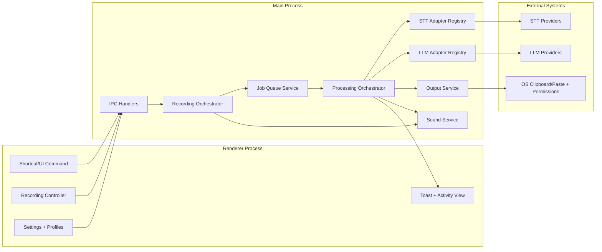
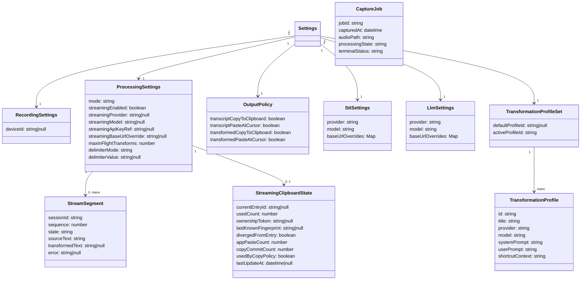
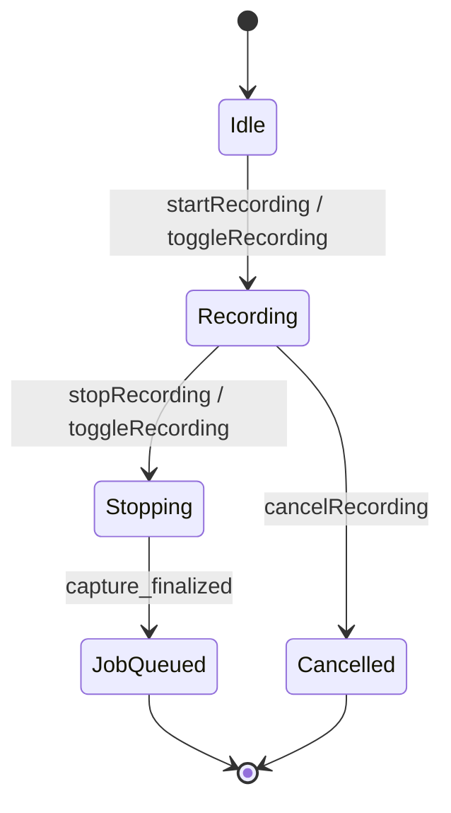
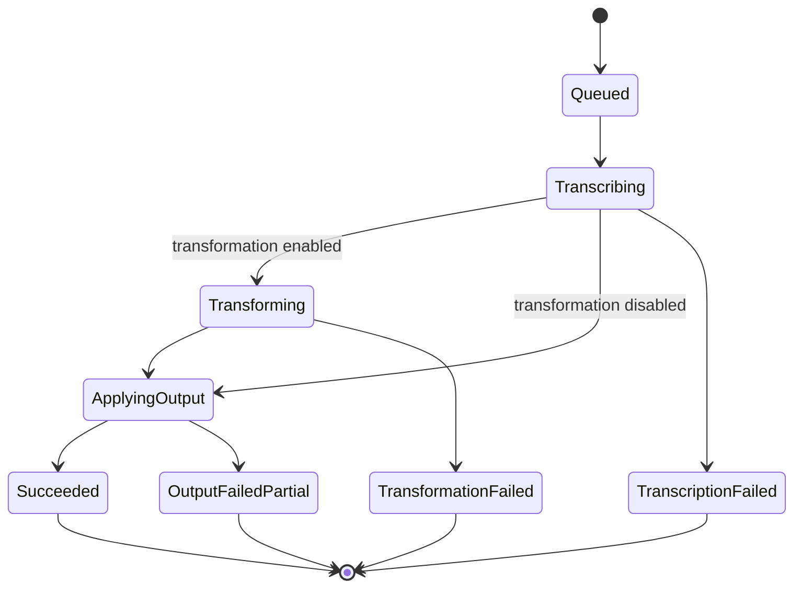
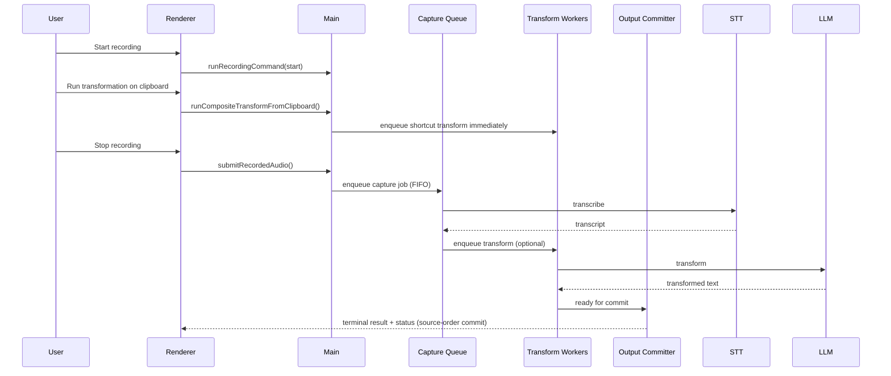
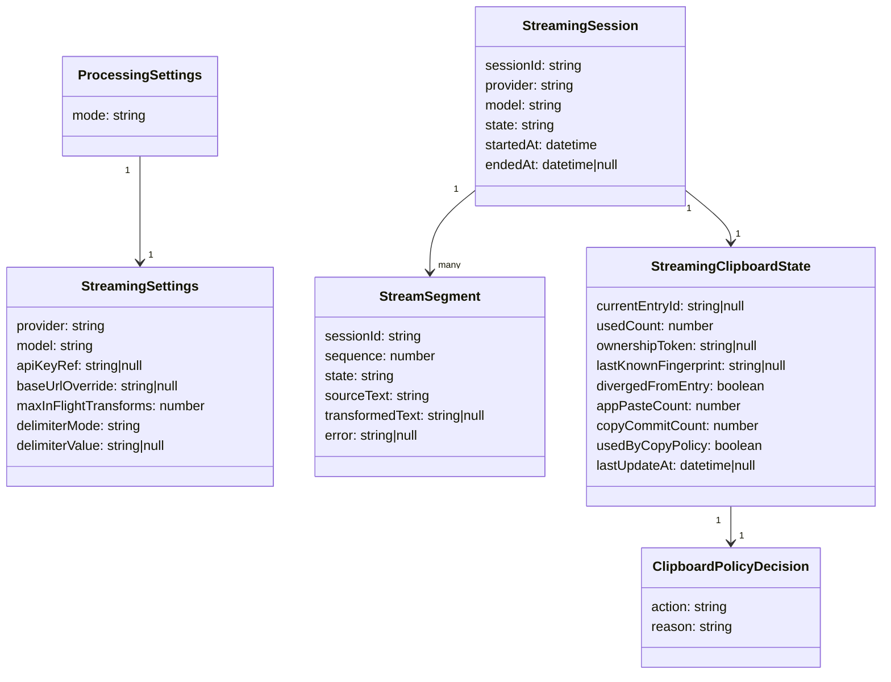
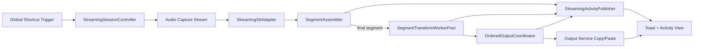
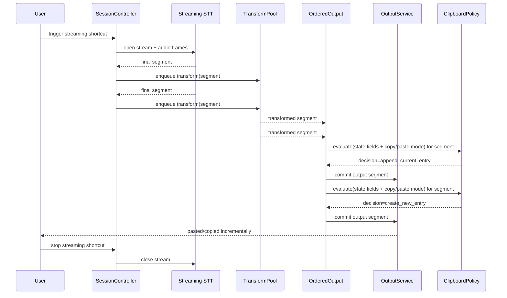

<!--
Where: specs/spec.md
What: Normative v1 implementation specification for the Speech-to-Text app.
Why: Define mandatory behavior and interfaces for delivery, testing, and review.
-->

# Speech-to-Text App Normative Specification (v1)

## 1. Scope

This document is the **normative** specification for v1.

It defines:
- Functional behavior.
- Runtime architecture constraints.
- Adapter models for STT and LLM APIs.
- Transformation profile scheme.
- Concurrency and non-blocking guarantees.
- Required user notifications and acceptance criteria.

Out of scope for v1:
- Voice-activated recording.
- Real-time streaming transcription/agent behavior.
- Non-macOS runtime targets.
- Enterprise governance/compliance features.

### 1.1 Product direction summary

v1 product direction emphasizes:
- fast capture-to-text turnaround for practical daily usage.
- explicit output behavior via independent copy/paste controls.
- transformation as optional (raw transcription remains first-class output).
- resilient back-to-back recording and non-blocking interaction.

### 1.2 v1 delivery scope summary

v1 delivery scope:
- runtime: Electron desktop app.
- platform: macOS.
- STT providers: Groq and ElevenLabs.
- LLM UI exposure: Google only (while architecture remains multi-provider).

Deferred beyond v1:
- voice-activation recording mode.
- real-time streaming production behavior (forward compatibility only in this spec).
- additional UI-exposed LLM provider options.

## 2. Terminology and Normative Language

### 2.1 Normative keywords

The key words **MUST**, **SHOULD**, and **MAY** in this document are to be interpreted as requirement levels:
- **MUST**: mandatory requirement.
- **SHOULD**: recommended unless a justified exception exists.
- **MAY**: optional behavior.

### 2.2 Terms

- **Capture**: an audio segment produced by `start/stop` or `toggle` recording commands.
- **Job**: one processing unit derived from one completed capture.
- **Stream segment**: one incremental finalized text unit produced during a real-time session.
- **Terminal status**: one final result state for a job.
- **STT adapter**: provider-specific implementation that produces normalized transcript output.
- **LLM adapter**: provider-specific implementation that produces normalized transformed output.
- **Transformation profile**: named transformation configuration (title, provider, model, prompts, shortcut metadata).

## 3. System Model

### 3.1 Product model

The app is an Electron-based macOS utility that:
1. Captures speech audio.
2. Sends audio to selected STT provider/model.
3. Optionally applies LLM transformation.
4. Applies output actions (clipboard/paste).

### 3.2 Required capability model

v1 **MUST** support:
- Multiple STT APIs via adapters.
- Multiple LLM APIs via adapters.
- Multiple transformation profiles.
- Global shortcuts.
- Audio device detection.
- Sound notifications for recording and transformation completion.
- Non-blocking user actions across recording/transformation/transcription.

### 3.3 Architecture overview



### 3.4 Architecture evolution constraints

To support future streaming mode without breaking v1 behavior, the architecture **MUST** preserve these boundaries:
- A mode-aware orchestration entrypoint **MUST** route commands to either default batch pipeline or streaming pipeline.
- STT/LLM adapter registries **MUST** remain transport-agnostic (batch and streaming adapters behind provider contracts).
- Output policy evaluation **MUST** be isolated from transcription/transformation execution logic.
- Clipboard state tracking **MUST** be implemented as a dedicated policy component, not embedded in provider adapters.

## 4. Functional Requirements

### 4.1 Recording commands

The system **MUST** support these global and UI-triggerable recording commands:
- `startRecording`
- `stopRecording`
- `toggleRecording`
- `cancelRecording`

Behavior:
- `startRecording` **MUST** fail with actionable error when microphone access is unavailable.
- `stopRecording` **MUST** finalize the current capture into exactly one job.
- `cancelRecording` **MUST** stop active capture and **MUST NOT** enqueue a processing job.
- `toggleRecording` **MUST** start if idle and stop if recording.

### 4.2 Global shortcuts

- Shortcuts **MUST** be configurable by user settings.
- The app **MUST** support changing global shortcut keybinds from Settings.
- Changed keybinds **MUST** persist across app restart/login.
- Changed keybinds **MUST** be re-registered and applied without requiring app restart.
- Shortcut registration **MUST** happen in main process.
- Shortcut execution **MUST** remain active after login auto-start.
- Recording commands (`startRecording`, `stopRecording`, `toggleRecording`, `cancelRecording`) **MUST** each have global shortcut bindings.
- Invalid shortcut strings **SHOULD** be rejected with user-visible feedback.
- Conflicting keybinds **SHOULD** be rejected with actionable validation feedback.
- If global shortcut registration fails at runtime, the app **MUST** show actionable user feedback and **MUST** keep UI command execution available.
- Transformation shortcuts **MUST** be common across profiles (not profile-specific).
- The system **MUST** provide these transformation-related shortcuts:
  - Run default transformation profile against top item in clipboard.
  - Pick active transformation profile and run against top item in clipboard.
  - Change default transformation profile.
  - Run transformation against cursor-selected text.

Transformation shortcut semantics:
- `runDefaultTransformation` **MUST** execute with `transformationProfiles.defaultProfileId` when set.
- if `transformationProfiles.defaultProfileId` is `null`, `runDefaultTransformation` **MUST NOT** invoke LLM transformation and **MUST** return a non-error skipped outcome.
- `pickAndRunTransformation` **MUST** execute using the user-picked profile for that request only.
- `pickAndRunTransformation` **MUST NOT** update `transformationProfiles.activeProfileId` as a side effect.
- `changeDefaultTransformation` **MUST** set `transformationProfiles.defaultProfileId` to current `activeProfileId` without executing transformation.
- `runTransformationOnSelection` **MUST** execute using current `activeProfileId`; if no selection text exists, it **MUST** fail with actionable user feedback.
- when a transformation shortcut executes during active recording, execution **MUST** start immediately in parallel and **MUST NOT** wait for current recording job completion.
- each shortcut execution request **MUST** bind a profile snapshot at enqueue time and **MUST NOT** be affected by later `activeProfileId`/`defaultProfileId` changes.
- if multiple transformation shortcuts fire concurrently, each request **MUST** retain its own bound profile snapshot and source text snapshot.
- `shortcutContext` **MUST** define dispatch behavior:
  - `default-target` => resolve profile from `defaultProfileId` when non-null; otherwise skip transformation with actionable non-error feedback.
  - `active-target` => resolve profile from `activeProfileId`.
  - `selection-target` => resolve profile from `activeProfileId` and selection text source.
- `pickAndRunTransformation` is request-scoped; subsequent requests **MUST** continue to use the current persisted `activeProfileId` unless explicitly changed elsewhere.

### 4.3 Sound notifications

The app **MUST** play notification sounds for:
- Recording started.
- Recording stopped.
- Recording cancelled.
- Transformation finished (success or failure).

Additional notes:
- Distinct tones **SHOULD** be used for success vs failure.
- Sound volume selection **MAY** be user-configurable.

### 4.4 Audio device detection

- The app **MUST** detect available audio input devices.
- The app **MUST** provide a system default device option.
- If multiple devices are available, the user **MUST** be able to select one.
- If selected device becomes unavailable, capture **MUST** fall back to system default with warning.

### 4.5 Non-blocking interaction model

The app **MUST NOT** block user actions while asynchronous processing runs.

Required concurrent behavior:
- While recording, user **MUST** be able to run transformation actions.
- While transcription request is in flight, user **MUST** be able to start/stop/cancel next recording.
- While transformation request is in flight, recording commands **MUST** still respond.

Queue guarantees:
- Every completed capture **MUST** map to exactly one job.
- Completed captures **MUST NOT** be dropped during back-to-back operations.
- Finalizing a capture **MUST** enqueue the job and **MUST** automatically start processing (STT, then optional transformation) without extra user action.
- queue policy **MUST** follow option A:
  - capture/STT work **MUST** preserve FIFO order by capture completion time.
  - transformation workers **MAY** process multiple jobs/segments concurrently and **MAY** complete out-of-order.
  - output commits **MUST** be applied in source sequence order for each logical stream/job chain.
- transformation shortcuts **MUST** enqueue into transformation worker path immediately and **MUST NOT** block capture enqueue/start behavior.
- recording commands **MUST** remain responsive while transformation and output commit work is in flight.

### 4.6 Output action matrix (default mode)

For non-streaming/default processing mode, output behavior **MUST** follow this matrix:
- `copy=false`, `paste=false`: no automatic output side effect.
- `copy=true`, `paste=false`: copy to clipboard only.
- `copy=false`, `paste=true`: paste at cursor only.
- `copy=true`, `paste=true`: copy and paste.

## 5. STT API Adapter Model

### 5.1 STT adapter contract

Each STT adapter **MUST** implement:
- `providerId` (stable string key).
- `supportedModels` (allowlist).
- `transcribe(input)` -> normalized transcription result or typed failure.

Input contract:
- `audioFilePath` or binary payload reference.
- `model`.
- `apiKeyRef`.
- Optional `baseUrlOverride`.
- Optional language and temperature controls.

Output contract:
- `text` (string).
- `provider`.
- `model`.
- Optional metadata (duration, confidence segments).

### 5.2 STT provider requirements

v1 **MUST** support at least these STT providers:
- Groq (Whisper-compatible endpoint).
- ElevenLabs (speech-to-text endpoint).

Rules:
- User **MUST** pre-configure STT provider in Settings before recording/transcription execution.
- User **MUST** pre-configure STT model in Settings before recording/transcription execution.
- The app **MUST NOT** automatically choose or switch STT provider/model when configuration is missing.
- If STT provider is unset, the app **MUST** show actionable error and **MUST NOT** start STT request.
- If STT model is unset, the app **MUST** show actionable error and **MUST NOT** start STT request.
- API key configuration for each STT provider **MUST** be available in Settings and **MUST** be persisted securely.
- STT provider configuration **MUST** support optional base URL override in Settings.
- STT base URL overrides **MUST** be stored in `settings.transcription.baseUrlOverrides` keyed by provider id.
- When STT base URL override is set, STT requests **MUST** use the override instead of provider default endpoint.
- STT request execution **MUST** be blocked when required STT API key is missing or invalid, and the app **MUST** show actionable error.
- Unsupported model/provider combinations **MUST** be rejected before network call.
- API authentication failures **MUST** emit explicit user-facing error.
- Provider switching **MAY** be user-selected in settings, but automatic failover **MUST NOT** occur silently.

## 6. LLM API Adapter Model

### 6.1 LLM adapter contract

Each LLM adapter **MUST** implement:
- `providerId`.
- `supportedModels`.
- `transform(input)` -> normalized transformed output or typed failure.

Input contract:
- `text` (source transcript or clipboard text).
- `model`.
- `apiKeyRef`.
- Optional `baseUrlOverride`.
- `systemPrompt` and `userPrompt`.

Output contract:
- `text` (transformed output).
- `provider`.
- `model`.

### 6.2 LLM provider requirements

v1 **MUST** support multiple LLM providers at architecture level through adapters.

Implementation note:
- v1 deployment **MAY** enable a limited provider/model allowlist, but the adapter abstraction **MUST** remain multi-provider capable.
- For current v1 UI, Google **MUST** be the only exposed LLM provider option.
- Additional LLM providers **MAY** be implemented behind adapter interfaces without being exposed in v1 UI.
- API key configuration for each implemented LLM provider **MUST** be available in Settings and **MUST** be persisted securely.
- LLM provider configuration **MUST** support optional base URL override in Settings.
- LLM base URL overrides **MUST** be stored in `settings.transformation.baseUrlOverrides` keyed by provider id.
- When LLM base URL override is set, LLM requests **MUST** use the override instead of provider default endpoint.
- LLM request execution **MUST** be blocked when required LLM API key is missing or invalid, and the app **MUST** show actionable error.
- Runtime transformation execution **MUST** resolve provider/model/prompt fields from the bound transformation profile snapshot, not from global `settings.llm.provider` or `settings.llm.model`.
- `settings.llm.provider` and `settings.llm.model` **MAY** be used only as defaults for profile creation/edit UX and **MUST NOT** override any persisted profile at execution time.

Failure behavior:
- Transformation failure **MUST** keep original transcript available.
- Transformation failure **MUST** produce explicit terminal status.

## 7. Transformation Scheme

### 7.1 Multi-profile requirement

The app **MUST** support multiple transformation profiles.

Each profile **MUST** include:
- `id` (stable unique key).
- `title` (user-visible name).
- `provider`.
- `model`.
- `systemPrompt`.
- `userPrompt`.
- `shortcutContext` metadata used by shared transformation shortcuts to identify active/default profile targeting semantics.

Additional rules:
- `defaultProfileId` **MUST** be either one valid profile id or `null`.
- One active profile **MUST** be selectable independently from default.
- Profile edits **MUST** persist across app restart.

### 7.2 Transformation data schema

```yaml
settings:
  recording:
    deviceId: null # null means system default input device
  processing:
    mode: "default" # default | streaming
    streaming:
      enabled: false
      provider: null # e.g. apple_speech | openai_realtime
      model: null
      apiKeyRef: null
      baseUrlOverride: null
      maxInFlightTransforms: 2
      delimiterPolicy:
        mode: "tbd" # tbd | none | space | newline | custom
        value: null
  stt:
    provider: "groq"
    model: "whisper-large-v3-turbo"
    baseUrlOverrides:
      groq: null
      elevenlabs: null
  llm:
    provider: "google"
    model: "gemini-1.5-flash-8b"
    baseUrlOverrides:
      google: null
  output:
    transcript:
      copyToClipboard: true
      pasteAtCursor: false
    transformed:
      copyToClipboard: true
      pasteAtCursor: false

transformationProfiles:
  defaultProfileId: null # nullable: null means no default transformation
  activeProfileId: "default"
  profiles:
    - id: "default"
      title: "Default Rewrite"
      provider: "google"
      model: "gemini-1.5-flash-8b"
      systemPrompt: ""
      userPrompt: "{{input}}"
      shortcutContext: "default-target"
```

### 7.3 Data model diagram



## 8. Lifecycle and Concurrency

### 8.1 Recording lifecycle



### 8.2 Processing lifecycle



### 8.3 Non-blocking execution sequence



## 9. Error Handling and Observability

- Every failed operation **MUST** emit actionable user feedback.
- The app **MUST** show toast notifications for:
  - command start/stop/cancel outcomes
  - transformation completion outcomes
  - validation and network/API failures
- Terminal statuses **MUST** be one of:
  - `succeeded`
  - `capture_failed`
  - `transcription_failed`
  - `transformation_failed`
  - `output_failed_partial`
- Network failures **SHOULD** include provider endpoint context.

## 10. Conformance and Test Requirements

### 10.1 Required automated tests

The test suite **MUST** include:
1. Multiple transformation profile CRUD + default/active enforcement.
2. STT adapter allowlist rejection behavior.
3. LLM adapter allowlist rejection behavior.
4. Global shortcut dispatch for recording commands.
5. Sound notification trigger tests for:
   - recording start
   - recording stop
   - recording cancel
   - transformation completion
6. Audio device discovery with multiple device options.
7. Back-to-back capture reliability without dropped jobs.
8. Non-blocking behavior tests proving recording commands remain available while transcription/transformation is running.
9. Transformation shortcut behavior tests:
   - run default profile on clipboard top item
   - pick-and-run profile on clipboard top item
   - change default profile
   - run transformation against cursor-selected text
10. STT pre-configuration validation tests:
   - unset STT provider blocks STT execution with explicit user-facing error
   - unset STT model blocks STT execution with explicit user-facing error
11. Provider API key validation tests:
   - missing/invalid STT provider key blocks transcription request with explicit error
   - missing/invalid LLM key blocks transformation request with explicit error
12. Base URL override routing tests:
   - STT adapter uses configured base URL override when set
   - LLM adapter uses configured base URL override when set
13. Capture finalization automation test:
   - finalized capture enqueues and automatically starts STT processing without extra user action

### 10.2 Manual verification checklist

- User can select between at least two STT providers in settings.
- If STT provider or model is unset, UI shows explicit actionable error and no STT request is attempted.
- LLM UI exposes Google only in v1 while adapter architecture remains multi-provider capable.
- User can create/edit/select multiple transformation profiles.
- Start/stop/cancel sounds are audible.
- Transformation completion sound is audible for both success and failure.
- UI remains responsive during active processing.

### 10.3 CI execution policy for e2e coverage

- Pull request and push CI **MUST** execute e2e coverage on macOS runners.
- macOS e2e workflow execution on pull request/push **SHOULD** be minimized to smoke checks.
- Expanded macOS e2e coverage (including live provider checks) **MUST** be available through manual `workflow_dispatch` execution.
- CI workflows **MUST** define concurrency controls that cancel redundant in-progress runs for the same workflow/ref.
- CI dependency setup **SHOULD** use lockfile-based caching to reduce repetitive install time.

## 11. Gap Closure vs Existing Docs

This spec closes these gaps from prior draft docs:
- Explicit normative language and requirement strength.
- Multi-provider adapter model requirements for both STT and LLM.
- Multiple transformation profile schema with required fields (`title`, `provider`, `model`, prompts).
- Mandatory non-blocking concurrency behavior.
- Mandatory recording/transformation sound notifications.
- Explicit architecture/data/lifecycle diagrams.

## 12. Forward Compatibility (Out of v1 Scope)

This section defines architecture constraints for future updates. It does not change v1 scope.

### 12.1 Future real-time streaming capability

Real-time streaming transcription remains out of scope for v1, but architecture **MUST** remain extensible to support:
- macOS Tahoe `SpeechAnalyzer`/`SpeechTranscriber` APIs.
- OpenAI real-time speech-to-text APIs.
- incremental transform + output application while streaming continues.

Future settings **MUST** allow user-selectable processing mode:
- `default` mode (current capture-then-process behavior).
- `streaming` mode (incremental real-time behavior).

Mode switching rules:
- user **MUST** be able to switch mode from Settings without reinstall/reconfiguration.
- mode selection **MUST** persist across app restarts.
- active mode **MUST** control which orchestration path is invoked by recording shortcuts.
- `processing.mode` **MUST** be authoritative for routing.
- if `processing.mode=streaming`, `processing.streaming.enabled` **MUST** be `true`.
- if `processing.mode=default`, `processing.streaming.enabled` **MUST** be `false` or ignored by runtime.
- conflicting combinations of `processing.mode` and `processing.streaming.enabled` **MUST** be rejected by settings validation.

### 12.2 Future streaming provider model

Future versions **MUST** treat real-time STT as provider adapters behind a shared contract.

Provider support requirements:
- architecture **MUST** support multiple streaming STT providers.
- at least one local provider path **MUST** be supported through macOS Tahoe `SpeechAnalyzer`/`SpeechTranscriber`.
- cloud providers (including OpenAI real-time STT) **MAY** be selected by user settings.
- provider/model selection **MUST** be explicit; app **MUST NOT** silently switch streaming providers.

Required future adapter inputs:
- session audio stream reference.
- provider/model.
- `apiKeyRef` when required by provider.
- optional `baseUrlOverride`.
- stream/session options (language, chunk policy, VAD/finalization policy).

Credential/config rules:
- `settings.processing.streaming.apiKeyRef` **MUST** be the canonical configuration field for streaming provider credentials.
- the app **MUST** block streaming session start when selected provider requires `apiKeyRef` and the field is unset/invalid.

Required future adapter outputs:
- ordered stream events with monotonic `sequence`.
- event `kind` (`partial`, `final`, `error`, `end`).
- text payload for `partial`/`final`.

### 12.3 Future streaming execution model

When user triggers the assigned global shortcut in a streaming mode:
- app **MUST** start one streaming session.
- app **MUST** continue recording/transcribing until user ends session or provider closes stream.
- each finalized stream segment **MUST** be eligible for transformation independently.
- transformation for segment `N` **MUST NOT** block transcription of segment `N+1`.
- transcription for segment `N+1` **MUST** continue while transformation/output for segment `N` is running.
- output actions for segment `N` (copy/paste) **MUST** follow configured output policy and **MUST** preserve segment order.
- if one segment transformation fails, app **MUST** continue processing subsequent segments and emit actionable feedback.
- segment delimiter/join policy for incremental paste **MUST** be explicitly configurable in future versions; default behavior is **TBD** in this spec revision.
- streaming queue policy **MUST** follow option A:
  - finalized segment order from STT is authoritative source order.
  - transformation workers **MAY** complete segments out-of-order.
  - ordered output commit stage **MUST** commit side effects in source order.

Streaming output matrix:
- `copy=false`, `paste=false`: no clipboard/paste side effects; session status remains visible in activity/toast.
- `copy=true`, `paste=false`: clipboard-only side effects with streaming append/new-entry policy.
- `copy=false`, `paste=true`: paste-only side effects; no clipboard append/new-entry policy is required.
- `copy=true`, `paste=true`: both side effects; copy commit **MUST** mark the current streaming clipboard entry as used, and subsequent finalized segments **MUST** create a new clipboard entry instead of appending to the previous entry.

Streaming clipboard behavior (future requirement):
- the app **MUST** track whether the latest streaming clipboard entry has been used based on app-observable signals.
- app-observable signals **MUST** include at least:
  - clipboard ownership/fingerprint token written by the app for that entry.
  - clipboard divergence detection (current clipboard no longer matches app-owned token/fingerprint).
  - app-initiated paste-at-cursor execution count for that entry when paste-at-cursor is enabled.
  - copy commit for that entry when both copy and paste are enabled.
- paste-at-cursor enabled state **MUST NOT** be assumed; streaming clipboard policy **MUST** operate when paste-at-cursor is disabled.
- detection of paste performed externally by other apps is not guaranteed by this spec revision and **MAY** use heuristic fallback from clipboard divergence.
- if the latest streaming clipboard entry is unused, new finalized text **MUST** append to that same clipboard entry instead of creating a new entry.
- if the latest streaming clipboard entry has been used at least once, new finalized text **MUST** create a new clipboard entry.
- this policy **MUST** apply for both raw-transcript output and transformed output in streaming mode.

ClipboardStatePolicy contract:
- Inputs **MUST** include:
  - `currentEntryId`
  - `ownershipToken`
  - `lastKnownFingerprint`
  - `divergedFromEntry`
  - `appPasteCount`
  - `copyCommitCount`
  - output mode flags (`copy`, `paste`)
- Decision output **MUST** be exactly one of:
  - `append_current_entry`
  - `create_new_entry`
- if `copy=true` and `paste=true`, first copy commit for current entry **MUST** set used state immediately.
- Ordered output commit stage **MUST** invoke `ClipboardStatePolicy` before every clipboard write side effect.

### 12.4 Future streaming architecture components

Future streaming mode **SHOULD** introduce explicit components:
- `ModeRouter`: dispatches command flow to `default` vs `streaming` pipeline by current settings.
- `StreamingSessionController`: starts/stops one active streaming session, validates prerequisites, and coordinates lifecycle.
- `StreamingSttAdapter`: provider-specific stream client emitting ordered segment events.
- `SegmentAssembler`: converts provider partial/final events into stable finalized segments.
- `SegmentTransformWorkerPool`: runs transformation for finalized segments with bounded concurrency.
- `OrderedOutputCoordinator`: enforces segment-order output commit for copy/paste side effects.
- `ClipboardStatePolicy`: determines append-vs-new-entry behavior from app-observable state.
- `StreamingActivityPublisher`: emits per-session/per-segment status and actionable errors to renderer.

Component rules:
- `ModeRouter` **MUST** apply persisted processing mode and **MUST** fail fast on invalid mode values.
- `StreamingSessionController` **MUST** reject concurrent session starts unless explicit multi-session mode is added.
- `SegmentTransformWorkerPool` **MUST** support bounded in-flight work (`maxInFlight`) and backpressure behavior.
- `OrderedOutputCoordinator` **MUST** guarantee output side effects are committed in final segment order.
- `ClipboardStatePolicy` **MUST** operate when paste-at-cursor is disabled.
- `StreamingActivityPublisher` **MUST** surface both segment-local errors and session-level terminal reasons.

### 12.5 Future streaming schema additions (extends section 7.2)

```yaml
settings:
  processing:
    mode: "streaming"
    streaming:
      enabled: true
      provider: "apple_speech"
      model: "SpeechTranscriber.default"
      apiKeyRef: "APPLE_SPEECH_LOCAL" # nullable when provider does not require key

runtime:
  streamingSession:
    sessionId: "uuid"
    state: "active" # idle | active | stopping | ended | failed
    startedAt: "2026-02-16T00:00:00Z"
    endedAt: null
    provider: "openai_realtime"
    model: "gpt-4o-mini-transcribe"
  streamSegments:
    - sessionId: "uuid"
      sequence: 12
      state: "finalized" # partial | finalized | transformed | output_committed | failed
      sourceText: "it was sunday today"
      transformedText: "It was Sunday today."
      error: null
  streamingClipboardState:
    currentEntryId: "clipboard-entry-uuid"
    usedCount: 0
    ownershipToken: "app-stt-stream:session-uuid:entry-1"
    lastKnownFingerprint: "sha256:..."
    divergedFromEntry: false
    appPasteCount: 0
    copyCommitCount: 1
    usedByCopyPolicy: true
    lastUpdateAt: "2026-02-16T00:00:05Z"
  clipboardPolicyDecision:
    action: "create_new_entry" # append_current_entry | create_new_entry
    reason: "copy_and_paste_marks_used"
```



### 12.6 Future streaming architecture diagram



### 12.7 Future streaming sequence example



### 12.8 Future streaming safeguards

To keep non-blocking behavior consistent with section 4.5, future streaming mode **SHOULD**:
- isolate capture/transcription from transformation/output via internal queues.
- cap in-flight transformations to prevent unbounded memory growth.
- expose per-segment status in activity/toast UI.
- keep recording command handling responsive while segment transforms are in flight.
- keep per-segment commit idempotent to tolerate retries/reconnects.

## 13. Decision Log (Resolved)

1. v1 UI exposes Google only for LLM selection, while architecture remains multi-provider capable.
2. Transformation completion sound plays on both success and failure.
3. Transformation shortcuts are common across profiles and include:
   - run default profile on clipboard top item
   - pick-and-run profile on clipboard top item
   - change default profile
   - run transformation against cursor-selected text
