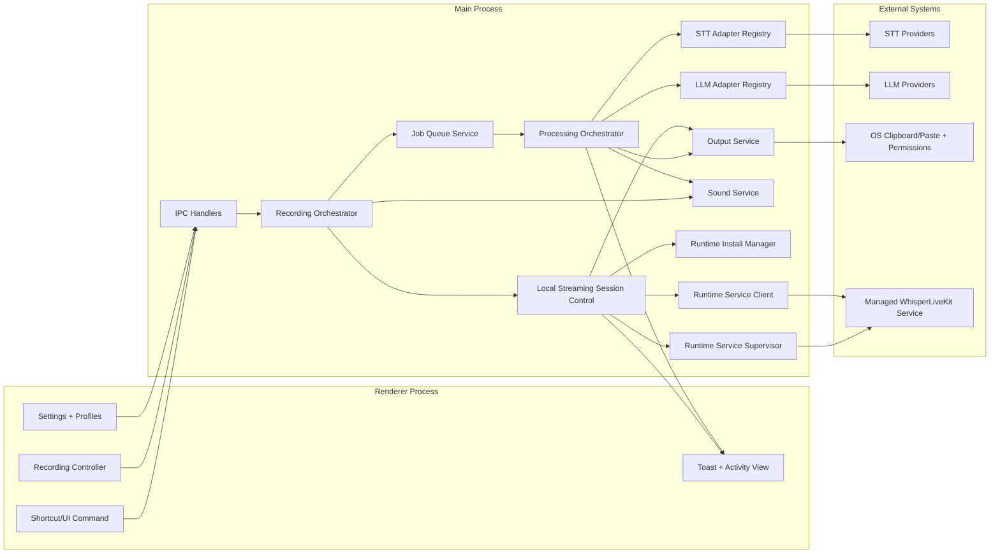
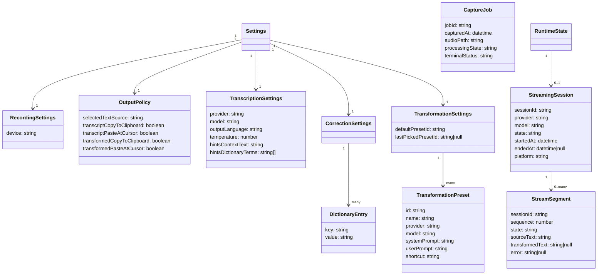
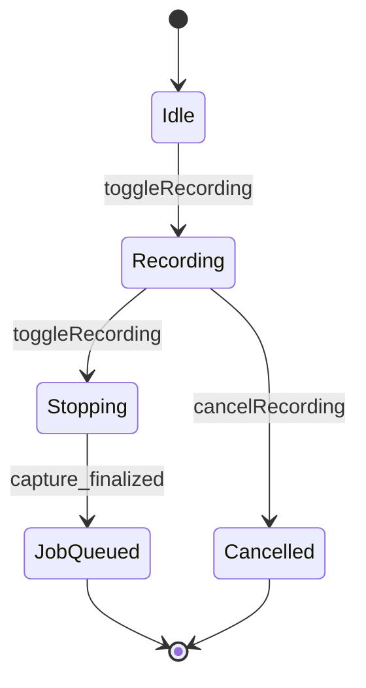
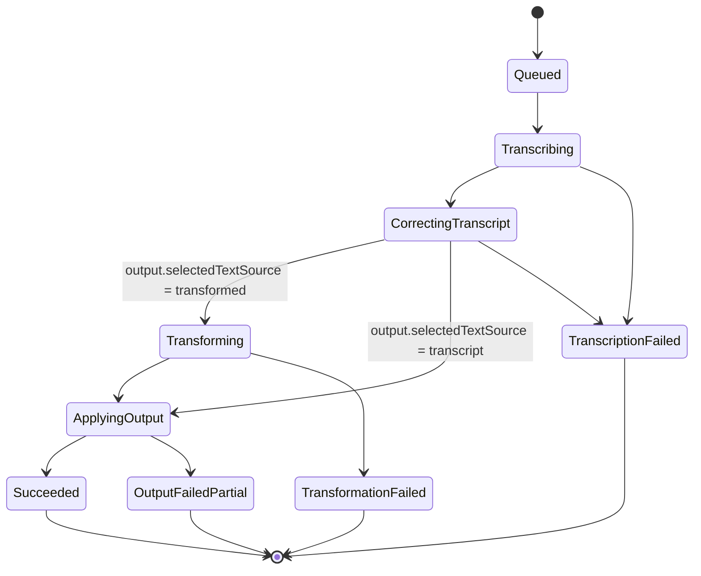
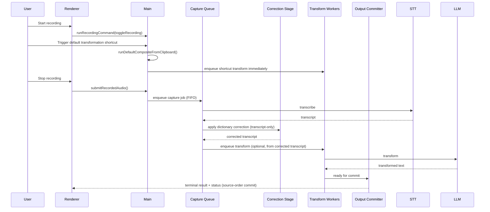
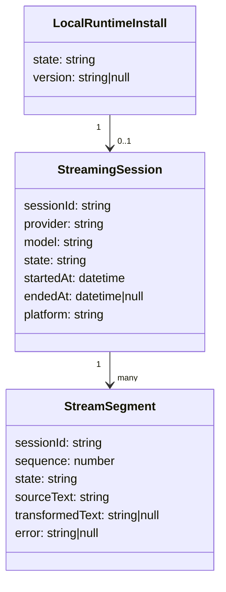
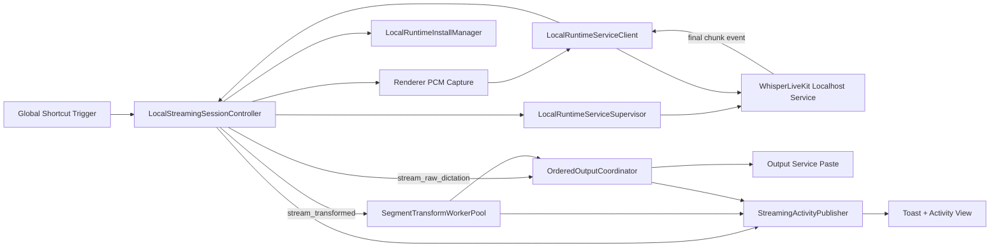
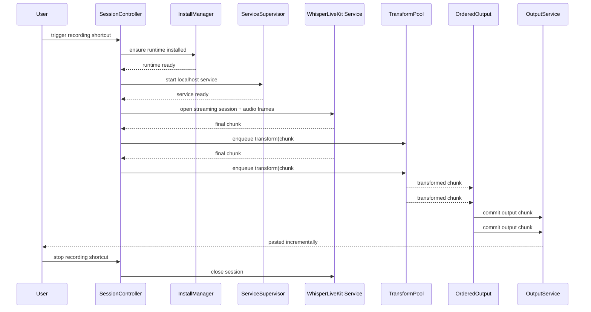

<!--
Where: specs/spec.md
What: Normative v1 implementation specification for the Speech-to-Text app.
Why: Define mandatory behavior and interfaces for delivery, testing, and review.
-->

# Speech-to-Text App Normative Specification (v1)

## 1. Scope

This document is the **normative** specification for v1.

It defines:
- Functional behavior.
- Runtime architecture constraints.
- Adapter models for STT and LLM APIs.
- Transformation profile scheme.
- Concurrency and non-blocking guarantees.
- Required user notifications and acceptance criteria.

Out of scope for v1:
- Voice-activated recording.
- Non-macOS runtime targets.
- Enterprise governance/compliance features.

Streaming note:
- the shipped baseline remains batch-oriented
- this spec now also defines the **approved streaming extension** that will be implemented next while preserving the shipped batch path

### 1.1 Product direction summary

v1 product direction emphasizes:
- fast capture-to-text turnaround for practical daily usage.
- explicit output behavior via shared copy/paste destination controls.
- transformation as optional (raw transcription remains first-class output).
- resilient back-to-back recording and non-blocking interaction.

### 1.2 v1 delivery scope summary

v1 delivery scope:
- runtime: Electron desktop app.
- platform: macOS.
- STT providers: Groq and ElevenLabs.
- LLM UI exposure: Google only (while architecture remains multi-provider).

Deferred beyond v1:
- voice-activation recording mode.
- additional UI-exposed LLM provider options.

Approved next workstream:
- add Apple Silicon macOS local streaming STT via an app-managed optional WhisperLiveKit runtime selected through the existing STT provider/model flow
- ship both raw dictation and transformed-text output for finalized utterance chunks
- keep current cloud batch STT behavior intact

## 2. Terminology and Normative Language

### 2.1 Normative keywords

The key words **MUST**, **SHOULD**, and **MAY** in this document are to be interpreted as requirement levels:
- **MUST**: mandatory requirement.
- **SHOULD**: recommended unless a justified exception exists.
- **MAY**: optional behavior.

### 2.2 Terms

- **Capture**: an audio segment produced by completing a `toggleRecording` recording cycle.
- **Job**: one processing unit derived from one completed capture.
- **Stream segment**: one incremental finalized text unit produced during a real-time session.
- **Terminal status**: one final result state for a job.
- **STT adapter**: provider-specific implementation that produces normalized transcript output.
- **LLM adapter**: provider-specific implementation that produces normalized transformed output.
- **Transformation preset**: named transformation configuration (`name`, provider, model, prompts, shortcut metadata).

## 3. System Model

### 3.1 Product model

The app is an Electron-based macOS utility that:
1. Captures speech audio.
2. Sends audio to selected STT provider/model.
3. Optionally applies LLM transformation.
4. Applies output actions (clipboard/paste).

### 3.2 Required capability model

v1 **MUST** support:
- Multiple STT APIs via adapters.
- Multiple LLM APIs via adapters.
- Multiple transformation profiles.
- Global shortcuts.
- Audio device detection.
- Sound notifications for recording and transformation completion.
- Non-blocking user actions across recording/transformation/transcription.

### 3.3 Architecture overview


```mermaid
flowchart LR
  subgraph UI[Renderer Process]
    A[Shortcut/UI Command]
    B[Recording Controller]
    C[Settings + Profiles]
    D[Toast + Activity View]
  end

  subgraph MAIN[Main Process]
    E[IPC Handlers]
    F[Recording Orchestrator]
    G[Job Queue Service]
    H[Processing Orchestrator]
    I[STT Adapter Registry]
    J[LLM Adapter Registry]
    K[Output Service]
    L[Sound Service]
    M[Local Streaming Session Control]
    Q[Runtime Install Manager]
    R[Runtime Service Supervisor]
    T[Runtime Service Client]
  end

  subgraph EXT[External Systems]
    N[STT Providers]
    O[LLM Providers]
    P[OS Clipboard/Paste + Permissions]
    S[Managed WhisperLiveKit Service]
  end

  A --> E
  B --> E
  C --> E
  E --> F
  F --> G
  G --> H
  H --> I --> N
  H --> J --> O
  H --> K --> P
  F --> M
  M --> Q
  M --> R --> S
  M --> T --> S
  M --> K
  M --> D
  F --> L
  H --> L
  H --> D
```

### 3.4 Architecture evolution constraints

To support the approved streaming mode without breaking shipped batch behavior, the architecture **MUST** preserve these boundaries:
- Recording orchestration **MUST** derive local-streaming vs batch behavior from the selected STT provider/model, not from a separate processing-mode setting.
- Batch STT/LLM adapter registries **MUST** remain isolated from local streaming session orchestration.
- Output policy evaluation **MUST** be isolated from transcription/transformation execution logic.
- Clipboard/paste policy evaluation **MUST** be implemented as a dedicated policy component, not embedded in provider adapters.
- The approved local streaming runtime architecture **MUST** use an app-managed optional localhost service boundary, not a bundled helper, not a renderer-side inference path, and not a first-version Node addon path.
- The localhost runtime boundary is chosen because it aligns with opt-in runtime installation, stronger realtime streaming semantics, and explicit ownership of install, supervision, session state, and output ordering.

## 4. Functional Requirements

### 4.1 Recording commands

The system **MUST** support these recording commands:
- `toggleRecording`
- `cancelRecording`

Behavior:
- `toggleRecording` **MUST** fail with actionable error when microphone access is unavailable.
- `toggleRecording` **MUST** finalize the current capture into exactly one job when toggled from recording to idle.
- `cancelRecording` **MUST** stop active capture and **MUST NOT** enqueue a processing job.
- `toggleRecording` **MUST** start if idle and stop if recording.

### 4.1.1 Home control surface

- Home **MUST** expose `toggleRecording` as the primary recording control.
- Home **MUST** show `cancelRecording` only while recording is active.
- Home **MUST NOT** render separate Start/Stop recording buttons.
- Home **MUST NOT** render a Run Transformation button.

### 4.2 Global shortcuts

- Shortcuts **MUST** be configurable by user settings.
- The app **MUST** support changing global shortcut keybinds from Settings.
- Changed keybinds **MUST** persist across app restart/login.
- Changed keybinds **MUST** be re-registered and applied without requiring app restart.
- Shortcut registration **MUST** happen in main process.
- Shortcut execution **MUST** remain active after login auto-start.
- Recording commands exposed as global shortcuts **MUST** include `toggleRecording` and `cancelRecording`.
- Invalid shortcut strings **SHOULD** be rejected with user-visible feedback.
- Conflicting keybinds **SHOULD** be rejected with actionable validation feedback.
- Shortcut capture UI **MUST** render Option-modified shortcuts with base key labels (for example `Opt+P`, `Opt+1`; not symbol substitutions like `Opt+π`).
- Shortcut capture recording mode **MUST** cancel immediately when focus leaves the target shortcut input/editor scope (outside click, focus transfer, or window/app focus loss).
- If global shortcut registration fails at runtime, the app **MUST** show actionable user feedback and **MUST** keep UI command execution available.
- Transformation shortcuts **MUST** be common across presets (not preset-specific).
- The system **MUST** provide these transformation-related shortcuts:
  - Run default transformation preset against top item in clipboard.
  - Pick a transformation preset and run against top item in clipboard.
  - Change default transformation preset.
  - Run transformation against cursor-selected text.

Transformation shortcut semantics:
- `runDefaultTransformation` **MUST** execute with `settings.transformation.defaultPresetId`.
- `pickAndRunTransformation` **MUST** execute using the user-picked preset for that request only.
- `pickAndRunTransformation` **MUST** persist `settings.transformation.lastPickedPresetId` to the selected preset after successful selection.
- `pickAndRunTransformation` **MUST NOT** update `settings.transformation.defaultPresetId` as a side effect.
- `changeDefaultTransformation` **MUST** set `settings.transformation.defaultPresetId` to a user-selected preset id without executing transformation.
- `runTransformationOnSelection` **MUST** require selection text; if no selection text exists, it **MUST** fail with actionable user feedback.
- `runTransformationOnSelection` **MUST** execute using `settings.transformation.defaultPresetId`.
- `runTransformationOnSelection` **MUST** use the "No text selected. Highlight text in the target app and try again." message only when selection text is empty/unreadable.
- `runTransformationOnSelection` **MUST** return a distinct actionable error when the selection-read operation itself fails (for example permissions/focus/runtime failures).
- when a transformation shortcut executes during active recording, execution **MUST** start immediately in parallel and **MUST NOT** wait for current recording job completion.
- each shortcut execution request **MUST** bind a preset snapshot at enqueue time and **MUST NOT** be affected by later `defaultPresetId` changes.
- if multiple transformation shortcuts fire concurrently, each request **MUST** retain its own bound preset snapshot and source text snapshot.
- picker focus for `pickAndRunTransformation` **MUST** resolve in this order:
  - `lastPickedPresetId` when valid.
  - `defaultPresetId` when valid.
  - first available preset.
- `pickAndRunTransformation` is request-scoped for execution; subsequent picker opens **MUST** use persisted `lastPickedPresetId` focus unless an explicit new selection is made.

### 4.2.1 Window close behavior and background shortcuts

- Closing the main window during normal operation **MUST** hide the app to background (instead of fully closing the renderer) so recording shortcuts remain functional.
- Explicit app quit **MUST** allow real window close/process shutdown and **MUST** be the lifecycle path that ends global shortcut availability.
- This behavior **MUST** apply consistently to installed builds and manual launches from packaged `dist/` output.

### 4.3 Sound notifications

The app **MUST** play notification sounds for:
- Recording started.
- Recording stopped.
- Recording cancelled.
- Successful capture completion.
- Transformation failure when transformation was attempted and failed.
- Successful `changeTransformationDefault` shortcut updates (default preset id actually changed).
- Successful capture completion **MUST** play the completion success sound exactly once regardless of `output.selectedTextSource` (`transcript` or `transformed`).

`changeTransformationDefault` sound semantics:
- The app **MUST** play `skyscraper_seven-click-buttons-ui-menu-sounds-effects-button-7-203601.mp3` only when shortcut-driven default profile change is committed.
- The app **MUST NOT** play that sound when picker selection is cancelled or keeps the same default profile.
- Direct default profile changes from renderer window controls **MUST** also play that sound after the settings update succeeds and the default profile actually changed.

Additional notes:
- Distinct tones **SHOULD** be used for success vs failure.
- Sound volume selection **MAY** be user-configurable.

### 4.4 Audio device detection

- The app **MUST** detect available audio input devices.
- The app **MUST** provide a system default device option.
- If multiple devices are available, the user **MUST** be able to select one.
- If selected device becomes unavailable, capture **MUST** fall back to system default with warning.

### 4.5 Non-blocking interaction model

The app **MUST NOT** block user actions while asynchronous processing runs.

Required concurrent behavior:
- While recording, user **MUST** be able to run transformation actions.
- While transcription request is in flight, user **MUST** be able to toggle/cancel next recording.
- While transformation request is in flight, recording commands **MUST** still respond.

Queue guarantees:
- Every completed capture **MUST** map to exactly one job.
- Completed captures **MUST NOT** be dropped during back-to-back operations.
- Finalizing a capture **MUST** enqueue the job and **MUST** automatically start processing (STT, then optional transformation) without extra user action.
- queue policy **MUST** follow option A:
  - capture/STT work **MUST** preserve FIFO order by capture completion time.
  - transformation workers **MAY** process multiple jobs/segments concurrently and **MAY** complete out-of-order.
  - output commits **MUST** be applied in source sequence order for each logical stream/job chain.
- transformation shortcuts **MUST** enqueue into transformation worker path immediately and **MUST NOT** block capture enqueue/start behavior.
- recording commands **MUST** remain responsive while transformation and output commit work is in flight.

### 4.6 Output action matrix (default mode)

For non-streaming/default processing mode, capture output behavior **MUST** select exactly one text source using `settings.output.selectedTextSource` (`transcript` | `transformed`) and **MUST NOT** emit both transcript and transformed text in the same successful capture run.

The copy/paste destination behavior **MUST** follow this matrix for the selected capture output source:
- `copy=false`, `paste=false`: no automatic output side effect.
- `copy=true`, `paste=false`: copy to clipboard only.
- `copy=false`, `paste=true`: paste at cursor only.
- `copy=true`, `paste=true`: copy and paste.

Additional capture output rules:
- If `selectedTextSource=transformed` and transformed text is unavailable because automatic transformation was skipped or failed, capture output **MUST** fall back to transcript text while preserving the configured destinations.
- Settings UI **SHOULD** present shared destination controls and keep `output.transcript` / `output.transformed` destination rules synchronized when those legacy-compatible fields are retained in persisted settings.

### 4.7 User dictionary (speech correction)

The app **MUST** provide a global app-level user dictionary for speech correction as `key=value` entries.
Feature issue: https://github.com/massun-onibakuchi/speech-to-text-app/issues/406

CRUD behavior:
- User **MUST** be able to add a dictionary entry with `key=value`.
- User **MUST** be able to update an existing dictionary entry value by key.
- User **MUST** be able to remove an existing dictionary entry by key.
- Dictionary entry `key` **MUST** be at most 128 characters.
- Dictionary entry `value` **MUST** be at most 256 characters.
- Add operations **MUST** fail when the key already exists.
- Key uniqueness checks **MUST** be case-insensitive.

Replacement behavior:
- Dictionary replacement **MUST** use exact string matching.
- Exact matching **MUST** be case-insensitive.
- User dictionary entries **MUST** be appended to STT model input as recognition hints.
- Recognition hints **MUST** be mapped to provider-native STT fields (for example Whisper `prompt`, ElevenLabs Scribe `keyterms`).
- User dictionary hints **MUST NOT** be routed through generic LLM/chat `systemPrompt` or `userPrompt` fields.
- Dictionary replacement **MUST** run on transcript output only.
- Dictionary replacement **MUST NOT** run on transformed output.

Dictionary tab behavior:
- The app **MUST** expose a dedicated top-level **Dictionary** tab in the main workspace tab rail.
- Dictionary tab **MUST** support add/update/remove interactions for dictionary entries.
- Dictionary delete **MUST** execute immediately without a confirmation dialog.
- Dictionary entries **MUST** be displayed in alphabetical order by `key`.
- Persisted dictionary entries **MUST** be normalized to alphabetical order by `key` at write time.
- Alphabetical ordering **MUST** use a case-insensitive key comparator with deterministic tie-break on raw key bytes.

Rationale for transcript-only replacement (`4.7` apply stage):
- It provides deterministic single-stage correction and prevents double mutation across transcript and transformed paths.
- It preserves transformation behavior and prompt intent by feeding corrected transcript once into transformation.
- It reduces regression/debug complexity by keeping one source of correction truth.

## 5. STT API Adapter Model

### 5.1 STT adapter contract

Each STT adapter **MUST** implement:
- `providerId` (stable string key).
- `supportedModels` (allowlist).
- `transcribe(input)` -> normalized transcription result or typed failure.

Input contract:
- `audioFilePath` or binary payload reference.
- `model`.
- `apiKeyRef`.
- Optional `baseUrlOverride` (internal adapter input only; not configured from v1 Settings).
- Optional language and temperature controls.
- Optional STT hints:
  - `contextText` (mapped to provider-native context fields when supported),
  - `dictionaryTerms` (mapped to provider-native lexical biasing fields such as `prompt` / `keyterms`).
- Optional recognition hints derived from user dictionary entries.

Recognition-hints mapping rules:
- STT adapters **MUST** map recognition hints to provider-native STT request fields.
- STT adapters **MUST NOT** map recognition hints to LLM/chat prompt channels.
- Groq Whisper-compatible requests **MUST** map hints to Whisper-native prompt field semantics.
- ElevenLabs Scribe requests **MUST** map hints to Scribe-native keyterm field semantics when supported by the selected model.
- If selected STT model does not expose hint fields, adapter behavior **MUST** degrade gracefully without using LLM/chat prompt channels.

Output contract:
- `text` (string).
- `provider`.
- `model`.
- Optional metadata (duration, confidence segments).

Local streaming runtime integrations **MUST** additionally expose a session-oriented contract.

This contract is owned by local streaming session orchestration and runtime service clients, not by the batch STT adapter registry described above.

Local streaming session contract:
- `startSession(input)` -> session handle or typed failure
- `appendAudio(sessionHandle, pcmFrames)` -> void or typed failure
- `stopSession(sessionHandle)` -> terminal status
- ordered emitted events with monotonic `sequence`

Local streaming session input contract:
- selected `model`
- output language
- renderer PCM frame batches
- optional recognition hints derived from user dictionary entries
- local finalization policy parameters

Local streaming event contract:
- `kind` (`final` | `error` | `end`)
- `sequence`
- `text` for `final`
- typed failure payload for `error`

Recognition-hints mapping for `local_whisperlivekit` **MUST** use the selected runtime/backend's native hint or prompt fields when supported and **MUST** degrade gracefully when the selected local model/runtime path does not expose a usable hint channel.

### 5.2 STT provider requirements

v1 **MUST** support at least these STT providers:
- Groq (Whisper-compatible endpoint).
- ElevenLabs (speech-to-text endpoint).

Rules:
- User **MUST** pre-configure STT provider in Settings before recording/transcription execution.
- User **MUST** pre-configure STT model in Settings before recording/transcription execution.
- For ElevenLabs in v1, supported model selection **MUST** use `scribe_v2`.
- The approved local streaming extension **MAY** add `local_whisperlivekit` as an additional provider in the same settings flow on supported machines.
- The app **MUST NOT** automatically choose or switch STT provider/model when configuration is missing.
- If STT provider is unset, the app **MUST** show actionable error and **MUST NOT** start STT request.
- If STT model is unset, the app **MUST** show actionable error and **MUST NOT** start STT request.
- API key configuration for each key-requiring STT provider **MUST** be available in Settings and **MUST** be persisted securely.
- STT API key save action for key-requiring providers **MUST** run connection validation automatically and **MUST NOT** persist the key when validation fails.
- STT API key UI for key-requiring providers **MUST NOT** require a separate explicit `Test Connection` action.
- STT provider configuration in v1 **MUST NOT** expose base URL override fields in Settings.
- STT requests **MUST** use provider default endpoints in v1 runtime settings flow.
- STT request execution **MUST** be blocked when a required STT API key is missing or invalid, and the app **MUST** show actionable error.
- Unsupported model/provider combinations **MUST** be rejected before network call.
- API authentication failures **MUST** emit explicit user-facing error.
- Provider switching **MAY** be user-selected in settings, but automatic failover **MUST NOT** occur silently.

## 6. LLM API Adapter Model

### 6.1 LLM adapter contract

Each LLM adapter **MUST** implement:
- `providerId`.
- `supportedModels`.
- `transform(input)` -> normalized transformed output or typed failure.

Input contract:
- `text` (source transcript or clipboard text).
- `model`.
- `apiKeyRef`.
- Optional `baseUrlOverride` (internal adapter input only; not configured from v1 Settings).
- `systemPrompt` and `userPrompt`.

Output contract:
- `text` (transformed output).
- `provider`.
- `model`.

### 6.2 LLM provider requirements

v1 **MUST** support multiple LLM providers at architecture level through adapters.

Implementation note:
- v1 deployment **MAY** enable a limited provider/model allowlist, but the adapter abstraction **MUST** remain multi-provider capable.
- For current v1 UI, Google **MUST** be the only exposed LLM provider option.
- Additional LLM providers **MAY** be implemented behind adapter interfaces without being exposed in v1 UI.
- API key configuration for each implemented LLM provider **MUST** be available in Settings and **MUST** be persisted securely.
- LLM API key save action **MUST** run connection validation automatically and **MUST NOT** persist the key when validation fails.
- LLM API key UI **MUST NOT** require a separate explicit `Test Connection` action.
- LLM provider configuration in v1 **MUST NOT** expose base URL override fields in Settings.
- LLM requests **MUST** use provider default endpoints in v1 runtime settings flow.
- LLM request execution **MUST** be blocked when required LLM API key is missing or invalid, and the app **MUST** show actionable error.
- Runtime transformation execution **MUST** resolve provider/model/prompt fields from the bound transformation preset snapshot.
- A global transformation provider/model default **MUST NOT** override any persisted preset at execution time.

Failure behavior:
- Transformation failure **MUST** keep original transcript available.
- Transformation failure **MUST** produce explicit terminal status.

## 7. Transformation Scheme

### 7.1 Multi-preset requirement

The app **MUST** support multiple transformation presets.

Each preset **MUST** include:
- `id` (stable unique key).
- `name` (user-visible name).
- `provider`.
- `model`.
- `systemPrompt`.
- `userPrompt`.
- `shortcut` display metadata.

Additional rules:
- `defaultPresetId` **MUST** reference one valid preset id.
- `lastPickedPresetId` **MAY** be `null` or one preset id and **MUST** be used only for picker focus memory.
- `defaultPresetId` **MUST** be the only user-facing persisted preset target for manual/default transformation flows.
- Capture-time transformation **MUST** be derived from `output.selectedTextSource` (not from a separate auto-run toggle).
- Preset edits **MUST** persist across app restart.

### 7.2 Transformation data schema

```yaml
settings:
  recording:
    device: "system_default"
  transcription:
    provider: "groq" # groq | elevenlabs | local_whisperlivekit
    model: "whisper-large-v3-turbo" # or voxtral-mini-4b-realtime-mlx
    outputLanguage: "auto"
    temperature: 0
    hints:
      contextText: ""
      dictionaryTerms: []
  transformation:
    defaultPresetId: "default"
    lastPickedPresetId: null
    presets:
      - id: "default"
        name: "Default"
        provider: "google"
        model: "gemini-2.5-flash"
        systemPrompt: ""
        userPrompt: ""
        shortcut: "Cmd+Opt+L"
  output:
    selectedTextSource: "transformed" # transcript | transformed; capture applies exactly one source
    transcript:
      copyToClipboard: true
      pasteAtCursor: false
    transformed:
      copyToClipboard: true
      pasteAtCursor: false
  correction:
    dictionary:
      entries:
        - key: "teh"
          value: "the"
        - key: "onibakuti"
          value: "onibakuchi"

  shortcuts:
    toggleRecording: "Cmd+Opt+T"
    cancelRecording: "Cmd+Opt+C"
    runTransform: "Cmd+Opt+L"
    runTransformOnSelection: "Cmd+Opt+K"
    pickTransformation: "Cmd+Opt+P"
    changeTransformationDefault: "Cmd+Opt+M"
```

### 7.3 Data model diagram


```mermaid
classDiagram
  class Settings {
  }

  class RecordingSettings {
    device: string
  }

  class OutputPolicy {
    selectedTextSource: string
    transcriptCopyToClipboard: boolean
    transcriptPasteAtCursor: boolean
    transformedCopyToClipboard: boolean
    transformedPasteAtCursor: boolean
  }

  class TranscriptionSettings {
    provider: string
    model: string
    outputLanguage: string
    temperature: number
    hintsContextText: string
    hintsDictionaryTerms: string[]
  }

  class CorrectionSettings {
  }

  class DictionaryEntry {
    key: string
    value: string
  }

  class TransformationSettings {
    defaultPresetId: string
    lastPickedPresetId: string|null
  }

  class TransformationPreset {
    id: string
    name: string
    provider: string
    model: string
    systemPrompt: string
    userPrompt: string
    shortcut: string
  }

  class CaptureJob {
    jobId: string
    capturedAt: datetime
    audioPath: string
    processingState: string
    terminalStatus: string
  }

  class RuntimeState {
  }

  class StreamingSession {
    sessionId: string
    provider: string
    model: string
    state: string
    startedAt: datetime
    endedAt: datetime|null
    platform: string
  }

  class StreamSegment {
    sessionId: string
    sequence: number
    state: string
    sourceText: string
    transformedText: string|null
    error: string|null
  }

  Settings "1" --> "1" RecordingSettings
  Settings "1" --> "1" TranscriptionSettings
  Settings "1" --> "1" CorrectionSettings
  Settings "1" --> "1" TransformationSettings
  Settings "1" --> "1" OutputPolicy
  CorrectionSettings "1" --> "many" DictionaryEntry
  TransformationSettings "1" --> "many" TransformationPreset
  RuntimeState "1" --> "0..1" StreamingSession
  StreamingSession "1" --> "0..many" StreamSegment
```

## 8. Lifecycle and Concurrency

### 8.1 Recording lifecycle


```mermaid
stateDiagram-v2
  [*] --> Idle
  Idle --> Recording: toggleRecording
  Recording --> Stopping: toggleRecording
  Recording --> Cancelled: cancelRecording
  Stopping --> JobQueued: capture_finalized
  JobQueued --> [*]
  Cancelled --> [*]
```

### 8.2 Processing lifecycle


```mermaid
stateDiagram-v2
  [*] --> Queued
  Queued --> Transcribing
  Transcribing --> CorrectingTranscript
  CorrectingTranscript --> Transforming: output.selectedTextSource = transformed
  CorrectingTranscript --> ApplyingOutput: output.selectedTextSource = transcript
  Transforming --> ApplyingOutput
  ApplyingOutput --> Succeeded
  Transcribing --> TranscriptionFailed
  CorrectingTranscript --> TranscriptionFailed
  Transforming --> TransformationFailed
  ApplyingOutput --> OutputFailedPartial
  Succeeded --> [*]
  TranscriptionFailed --> [*]
  TransformationFailed --> [*]
  OutputFailedPartial --> [*]
```

### 8.3 Non-blocking execution sequence


```mermaid
sequenceDiagram
  participant U as User
  participant R as Renderer
  participant M as Main
  participant CQ as Capture Queue
  participant C as Correction Stage
  participant TW as Transform Workers
  participant OC as Output Committer
  participant S as STT
  participant L as LLM

  U->>R: Start recording
  R->>M: runRecordingCommand(toggleRecording)
  U->>M: Trigger default transformation shortcut
  M->>M: runDefaultCompositeFromClipboard()
  M->>TW: enqueue shortcut transform immediately
  U->>R: Stop recording
  R->>M: submitRecordedAudio()
  M->>CQ: enqueue capture job (FIFO)
  CQ->>S: transcribe
  S-->>CQ: transcript
  CQ->>C: apply dictionary correction (transcript-only)
  C-->>CQ: corrected transcript
  CQ->>TW: enqueue transform (optional, from corrected transcript)
  TW->>L: transform
  L-->>TW: transformed text
  TW->>OC: ready for commit
  OC-->>R: terminal result + status (source-order commit)
```

## 9. Error Handling and Observability

- Every failed operation **MUST** emit actionable user feedback.
- The app **MUST** show toast notifications for:
  - command start/stop/cancel outcomes
  - transformation completion outcomes
  - validation and network/API failures
- Terminal statuses **MUST** be one of:
  - `succeeded`
  - `capture_failed`
  - `transcription_failed`
  - `transformation_failed`
  - `output_failed_partial`
- Local streaming session terminal statuses **MUST** additionally include:
  - `session_start_failed`
  - `model_install_failed`
  - `model_prepare_failed`
  - `stream_interrupted`
- Network failures **SHOULD** include provider endpoint context.
- Local streaming failures **SHOULD** include the failing phase (`install`, `service_start`, `service_connect`, `prepare`, `stream_run`) and selected model id.

## 10. Conformance and Test Requirements

### 10.1 Required automated tests

The test suite **MUST** include:
1. Multiple transformation profile CRUD + default/last-picked enforcement.
2. STT adapter allowlist rejection behavior.
3. LLM adapter allowlist rejection behavior.
4. Global shortcut dispatch for recording commands.
5. Sound notification trigger tests for:
   - recording start
   - recording stop
   - recording cancel
   - transformation completion
6. Audio device discovery with multiple device options.
7. Back-to-back capture reliability without dropped jobs.
8. Non-blocking behavior tests proving recording commands remain available while transcription/transformation is running.
9. Transformation shortcut behavior tests:
   - run default preset on clipboard top item
   - pick-and-run preset on clipboard top item
   - pick-and-run remembers last selected preset as the next picker focus target
   - change default preset
   - run transformation against cursor-selected text
10. STT pre-configuration validation tests:
   - unset STT provider blocks STT execution with explicit user-facing error
   - unset STT model blocks STT execution with explicit user-facing error
11. Provider API key validation tests:
   - missing/invalid STT provider key blocks transcription request with explicit error
   - missing/invalid LLM key blocks transformation request with explicit error
12. Base URL override routing tests:
   - STT adapter uses configured base URL override when set
   - LLM adapter uses configured base URL override when set
13. Capture finalization automation test:
   - finalized capture enqueues and automatically starts STT processing without extra user action
14. Capture output selected text source tests:
   - capture output applies exactly one source selected by `output.selectedTextSource`
   - successful capture flow does not emit both transcript and transformed output in one run
   - if `selectedTextSource=transformed` and transformed text is unavailable, capture output falls back to transcript using the same destination settings
15. Window close / background shortcut lifecycle test:
   - closing the main window hides to background and recording shortcuts remain functional until explicit quit
16. User dictionary tests:
   - add/update/remove `key=value` flows
   - duplicate-key add rejection (case-insensitive)
   - `value` max-length validation rejects entries longer than 256 characters
   - user dictionary entries are appended to STT request input as recognition hints
   - provider mapping uses native STT fields (Whisper prompt, Scribe keyterms) and not generic LLM/chat prompts
   - exact case-insensitive replacement behavior
   - transcript-only apply-stage enforcement (no transformed-output replacement)
   - alphabetical ordering by key in persisted/displayed dictionary list
17. Local streaming tests:
   - selecting `local_whisperlivekit` routes recording commands to local streaming session orchestration
   - local provider options are visible only on Apple Silicon macOS
   - missing local runtime triggers install workflow before session start
   - `cancelRecording` during runtime install or prepare aborts startup and returns to idle without output commit
   - missing or invalid managed runtime installation fails with explicit user-facing error
   - runtime service crash during an active local session produces a service-specific terminal failure
   - finalized local chunks commit output in source order even when transforms finish out-of-order
   - continuous speech without pauses still forces chunk finalization within the configured utterance bound
   - transformed local chunks use the persisted default transformation preset bound at enqueue time
   - local provider selection forces paste-at-cursor and disables user-visible copy-to-clipboard

### 10.2 Manual verification checklist

- User can select between at least two STT providers in settings.
- If STT provider or model is unset, UI shows explicit actionable error and no STT request is attempted.
- LLM UI exposes Google only in v1 while adapter architecture remains multi-provider capable.
- User can create/edit/select multiple transformation presets.
- Closing the main window hides the app to background and recording shortcuts continue to work until explicit quit.
- Start/stop/cancel sounds are audible.
- Transformation completion sound is audible for both success and failure.
- UI remains responsive during active processing.
- Dictionary tab exists and allows add/update/remove `key=value` entries.
- Dictionary delete executes immediately with no confirmation dialog.
- Dictionary value input enforces max length of 256 characters with validation feedback.
- Dictionary list is sorted alphabetically by key.
- Apple Silicon Macs expose `Voxtral Mini 4B Realtime [streaming]` in the existing STT settings flow.
- Non-Apple-Silicon machines do not expose the local provider/model options.
- Selecting the local provider locks output to paste-at-cursor and visually explains why copy is disabled.
- First use of a missing local runtime shows install/preparing progress before the session becomes active.

User dictionary focused checklist (positive + negative):
- Add entry `teh=the` and verify it appears in Dictionary tab list.
- Add duplicate key with different case (`TEH=THE`) and verify add is rejected.
- Add entry with key length greater than `128` and verify validation error.
- Add entry with value length greater than `256` and verify validation error.
- Update existing entry value (for example `teh=thee`), restart the app, and verify persistence.
- Delete an entry and verify removal is immediate with no confirmation dialog.
- Verify sorted order is case-insensitive by adding mixed-case keys; include case-colliding keys to verify deterministic raw-byte tie-break order.
- Run transcript flow with known replacement key and verify transcript text is corrected case-insensitively.
- Reuse the same recorded-audio fixture for transformed-output flow and verify there is no additional post-transform dictionary replacement pass.
- Verify STT hint mapping behavior via adapter-focused tests and/or debug payload logs:
  - Groq maps dictionary-derived hints to Whisper-compatible `prompt` semantics only.
  - ElevenLabs maps dictionary-derived hints to Scribe-compatible `keyterms` semantics only.
  - dictionary hints are not routed through LLM transformation `systemPrompt`/`userPrompt`.

### 10.3 CI execution policy for e2e coverage

- Pull request and push CI **MUST** execute e2e coverage on macOS runners.
- macOS e2e workflow execution on pull request/push **SHOULD** be minimized to smoke checks.
- Expanded macOS e2e coverage (including live provider checks) **MUST** be available through manual `workflow_dispatch` execution.
- CI workflows **MUST** define concurrency controls that cancel redundant in-progress runs for the same workflow/ref.
- CI dependency setup **SHOULD** use lockfile-based caching to reduce repetitive install time.

## 11. Gap Closure vs Existing Docs

This spec closes these gaps from prior draft docs:
- Explicit normative language and requirement strength.
- Multi-provider adapter model requirements for both STT and LLM.
- Multiple transformation preset schema with required fields (`name`, `provider`, `model`, prompts).
- Mandatory non-blocking concurrency behavior.
- Mandatory recording/transformation sound notifications.
- Explicit architecture/data/lifecycle diagrams.

## 12. Approved Local Streaming Extension

This section is normative for the approved next implementation phase. It extends the shipped batch baseline and **MUST NOT** remove or regress the default cloud batch behavior defined earlier in this spec.

### 12.1 Approved capability and activation model

Local streaming **MUST** be activated by the existing STT provider/model settings flow.

Activation rules:
- selecting `transcription.provider=local_whisperlivekit` **MUST** route recording commands to the local streaming lane
- selecting any cloud STT provider **MUST** continue to route recording commands to the existing batch capture pipeline
- the app **MUST NOT** expose a separate user-facing `processing.mode` control for this feature
- the app **MUST NOT** persist a second enablement boolean for local streaming
- local streaming feature exposure **MUST** be limited to macOS on Apple Silicon
- unsupported machines **MUST NOT** expose the local provider/model options as selectable runtime choices

Supported local models for this spec revision:
- `voxtral-mini-4b-realtime-mlx`, labeled `Voxtral Mini 4B Realtime [streaming]`

Delivery rules:
- the first local streaming implementation **MUST** support raw dictation output for finalized utterance chunks
- the first local streaming implementation **MUST** support transformed output for finalized utterance chunks
- transformed local streaming **MUST** use the existing persisted `settings.transformation.defaultPresetId` exactly as bound at chunk enqueue time
- the app **MUST** request explicit user confirmation before installing the optional local runtime
- the local runtime **MUST NOT** be bundled by default with the base app installation
- the first managed WhisperLiveKit install path **MUST** require Python `>=3.11 <3.14` on the host machine and **MUST** fail with actionable guidance when that prerequisite is missing or unsupported

### 12.2 Approved local provider contract

Local streaming in this spec revision is intentionally narrow:
- the only approved local streaming provider is `local_whisperlivekit`
- the provider **MUST NOT** require an API key
- provider/model selection **MUST** be explicit; app **MUST NOT** silently switch local models
- the local runtime install location **MUST** be app-managed writable data storage, not the signed application bundle
- the provider **MUST** run behind the app-managed localhost runtime architecture defined by ADR-0003
- the first shipped local runtime **MUST** be WhisperLiveKit with the `voxtral-mlx` backend
- runtime updates **MUST NOT** interrupt an active local streaming session
- runtime updates **MUST** occur only while no local session is active
- runtime version mismatch **MUST** be detected before starting a new local streaming session
- the app **MUST** install WhisperLiveKit from a pinned package spec that includes the `voxtral-mlx` backend dependency set

Required local runtime inputs:
- continuous PCM audio frames from the renderer capture path
- selected local model id
- output language
- dictionary-derived recognition hints when supported by the runtime
- session configuration supported by the runtime, including streaming delay/finalization settings when available

Required local runtime outputs:
- ordered finalized segment events with monotonic `sequence`
- segment `kind` values limited to `final`, `error`, and `end` for the first local implementation
- finalized text payload for `final`
- if the runtime emits interim or partial text events, the app **MUST** either suppress them at the runtime level or receive-and-discard them without creating a user-visible preview contract in v1

The first local provider path **MUST** be implemented as an app-managed localhost service, not as a bundled helper, not as a browser/WASM inference path, and not as a first-version Node addon path.

### 12.3 Approved execution and output model

When user triggers the recording shortcut with `transcription.provider=local_whisperlivekit`:
- app **MUST** start one local streaming session
- app **MUST** continue recording/transcribing until user ends session or the session fails terminally
- finalized utterance chunk order from STT **MUST** be the authoritative source order
- transformation for chunk `N` **MUST NOT** block transcription of chunk `N+1`
- output commits **MUST** preserve finalized chunk source order
- if one chunk transformation fails, app **MUST** continue processing subsequent chunks and emit actionable feedback for the failed chunk
- if user invokes `cancelRecording` during runtime install, service startup, prepare, or session start, the app **MUST** abort startup work where possible, end the pending session attempt without output side effects, and return to idle with actionable status
- the app **MUST** rely on the selected runtime's realtime streaming/finalization behavior and **MUST NOT** emulate streaming by batching a full recording and replaying delayed chunk output at the app layer
- if user invokes `cancelRecording` during an active session, already committed output **MUST** remain as-is, in-flight uncommitted transforms **MUST** be abandoned, and uncommitted chunks **MUST** be discarded

Effective streaming output mode derivation:
- `settings.output.selectedTextSource=transcript` with the local provider selected **MUST** produce effective mode `stream_raw_dictation`
- `settings.output.selectedTextSource=transformed` with the local provider selected **MUST** produce effective mode `stream_transformed`
- the app **MUST NOT** persist a second user-facing streaming output selector for the local provider path

Streaming output rules:
- local streaming **MUST** support these output modes:
  - `stream_raw_dictation`: commit finalized source text chunks in source order
  - `stream_transformed`: commit transformed finalized text chunks in source order
- in `stream_transformed`, the app **MUST** retain the raw finalized chunk text in runtime/activity state for debugging and traceability even though only transformed text is committed to user-facing output
- when local streaming provider is selected, the effective output destination **MUST** force `pasteAtCursor=true`
- when local streaming provider is selected, the effective output destination **MUST** force `copyToClipboard=false` as a user-facing mode
- any clipboard write performed in local streaming mode **MUST** be treated as an internal paste transport step, not as a separate user-visible copy mode
- the settings UI **MUST** render clipboard-copy as disabled and paste-at-cursor as enabled while the local provider is selected
- the settings UI **MUST** provide visual hover/help text explaining why those controls are locked

Segment state rules:
- each chunk **MUST** begin in `finalized` when first emitted by STT
- in `stream_transformed`, a successful transform **MUST** move the chunk to `transformed` before output commit
- in `stream_raw_dictation`, a chunk **MUST** be allowed to transition directly from `finalized` to `output_committed`
- any transform or output failure for a chunk **MUST** transition that chunk to `failed` without preventing later chunks from progressing

### 12.4 Approved local architecture responsibilities

The first local streaming architecture **MUST** provide these responsibilities:
- local session control: starts/stops one active local session, validates prerequisites, and coordinates lifecycle
- local runtime install management: installs, updates, verifies, and removes the optional WhisperLiveKit runtime and model/backend dependencies
- local runtime service supervision: launches the managed localhost service, monitors health, and reports startup/exit failures
- local runtime service client: owns the websocket/session connection to the localhost runtime and normalizes session events for the app
- segment transformation work: runs transformation for finalized chunks with bounded concurrency
- ordered output coordination: enforces source-order output commit for paste side effects
- streaming activity publication: emits per-session/per-chunk status and actionable errors to renderer

Component rules:
- local session control **MUST** reject concurrent local session starts unless explicit multi-session support is later added
- local session control **MUST** own the mode-dispatch decision for each finalized chunk, deciding whether it goes directly to ordered output (`stream_raw_dictation`) or to transformation first (`stream_transformed`)
- local runtime install management **MUST** mark the runtime available only after the pinned WhisperLiveKit environment and required backend/model dependencies are installed successfully
- local runtime install management **MUST** install into a staging root first and **MUST NOT** replace the committed runtime root until installation succeeds
- local runtime install management **MUST** define explicit update and uninstall behavior, and **MUST NOT** remove or replace the runtime while a local streaming session is active
- local runtime install management **MUST** own the `awaiting_user_confirmation -> installing -> ready|failed` state machine and publish those states to the renderer over explicit IPC rather than making the renderer infer them indirectly
- local runtime install management **MUST** expose renderer-visible `summary`, optional `detail`, install `phase`, and action availability flags at minimum for install/retry/cancel/uninstall affordances
- local runtime install management **MUST** treat install cancel as non-committing: cancelling during install leaves the previously committed runtime root untouched
- local runtime service supervision **MUST** fail fast with actionable error when service startup, backend initialization, or runtime prepare fails
- local runtime service supervision **MUST** prove readiness through authenticated control-plane probes before reporting the service ready to session control
- if the service exits or becomes unhealthy during an active session, the session **MUST** transition to `failed`, publish a service-specific terminal reason, and stop accepting further audio for that session
- the app-managed runtime **MUST** bind to loopback only
- the app-managed runtime **MUST** require an app-owned auth token, session token, or equivalent handshake so the localhost service is not treated as an unauthenticated open endpoint
- local runtime service supervision **MUST** mint a fresh app-owned localhost auth token for each launched runtime process and return it with the chosen endpoint details
- if the upstream runtime does not natively enforce the app-owned localhost auth token on both HTTP and WebSocket entrypoints, the app **MUST** wrap or guard the service entrypoint so that token is required before any local request is accepted
- the service port **MAY** be dynamic; when it is dynamic, the runtime service client **MUST** use the supervisor-provided endpoint rather than a hardcoded default
- the app **MUST** pin and manage the runtime version rather than relying on arbitrary user-managed runtime drift
- renderer-to-main audio transport **MUST** batch PCM frames into coarse chunks rather than per-frame tiny IPC messages
- segment transformation work **MUST** support bounded in-flight work and backpressure behavior
- ordered output coordination **MUST** guarantee output side effects are committed in finalized chunk order
- streaming activity publication **MUST** surface both chunk-local errors and session-level terminal reasons

### 12.5 Approved runtime state additions

```yaml
runtime:
  localRuntimeInstall:
    state: "ready" # not_installed | awaiting_user_confirmation | installing | ready | failed
    version: "pinned-version"
    phase: null # null | bootstrap | packages | backend
    summary: "Local runtime ready"
    detail: "WhisperLiveKit pinned-version with voxtral-mlx is installed."
    canRequestInstall: true
    canCancel: false
    canUninstall: true
    requiresUpdate: false
  localStreamingSession:
    sessionId: "uuid"
    state: "starting" # idle | awaiting_install_confirmation | installing_runtime | starting_service | preparing_runtime | starting | active | stopping | ended | failed
    startedAt: "2026-03-18T00:00:00Z"
    endedAt: null
    provider: "local_whisperlivekit"
    model: "voxtral-mini-4b-realtime-mlx"
    platform: "macos-apple-silicon"
  streamSegments:
    - sessionId: "uuid"
      sequence: 12
      state: "finalized" # finalized | transformed | output_committed | failed
      sourceText: "it was sunday today"
      transformedText: "It was Sunday today."
      error: null
```


```mermaid
classDiagram
  class LocalRuntimeInstall {
    state: string
    version: string|null
  }

  class StreamingSession {
    sessionId: string
    provider: string
    model: string
    state: string
    startedAt: datetime
    endedAt: datetime|null
    platform: string
  }

  class StreamSegment {
    sessionId: string
    sequence: number
    state: string
    sourceText: string
    transformedText: string|null
    error: string|null
  }

  LocalRuntimeInstall "1" --> "0..1" StreamingSession
  StreamingSession "1" --> "many" StreamSegment
```

### 12.6 Approved local architecture diagram


```mermaid
flowchart LR
  U[Global Shortcut Trigger] --> S[LocalStreamingSessionController]
  S --> CAP[Renderer PCM Capture]
  CAP --> C[LocalRuntimeServiceClient]
  S --> IM[LocalRuntimeInstallManager]
  S --> SUP[LocalRuntimeServiceSupervisor]
  SUP --> H[WhisperLiveKit Localhost Service]
  C --> H
  H -->|final chunk event| C
  C --> S
  S -->|stream_transformed| W[SegmentTransformWorkerPool]
  S -->|stream_raw_dictation| ORD[OrderedOutputCoordinator]
  W --> ORD
  ORD --> OUT[Output Service Paste]
  S --> PUB[StreamingActivityPublisher]
  W --> PUB
  ORD --> PUB
  PUB --> UI[Toast + Activity View]
```

### 12.7 Approved local sequence example


```mermaid
sequenceDiagram
  participant U as User
  participant S as SessionController
  participant I as InstallManager
  participant V as ServiceSupervisor
  participant H as WhisperLiveKit Service
  participant T as TransformPool
  participant OC as OrderedOutput
  participant O as OutputService

  U->>S: trigger recording shortcut
  S->>I: ensure runtime installed
  I-->>S: runtime ready
  S->>V: start localhost service
  V-->>S: service ready
  S->>H: open streaming session + audio frames
  H-->>S: final chunk #1 text
  S->>T: enqueue transform(chunk #1)
  H-->>S: final chunk #2 text
  S->>T: enqueue transform(chunk #2)
  T-->>OC: transformed chunk #2 (ready first)
  T-->>OC: transformed chunk #1
  OC->>O: commit output chunk #1
  OC->>O: commit output chunk #2
  O-->>U: pasted incrementally
  U->>S: stop recording shortcut
  S->>H: close session
```

### 12.8 Approved local safeguards

To keep non-blocking behavior consistent with section 4.5, local streaming **SHOULD**:
- isolate capture/transcription from transformation/output via internal queues
- cap in-flight transformations to prevent unbounded memory growth
- expose per-chunk status in activity/toast UI
- keep recording command handling responsive while chunk transforms are in flight
- keep per-chunk commit idempotent to tolerate retries
- surface explicit install-consent, runtime-install, service-start, and runtime-prepare states before first use when needed

## 13. Decision Log (Resolved)

1. v1 UI exposes Google only for LLM selection, while architecture remains multi-provider capable.
2. Transformation completion sound plays on both success and failure.
3. Transformation shortcuts are common across presets and include:
   - run default preset on clipboard top item
   - pick-and-run preset on clipboard top item
   - change default preset
   - run transformation against cursor-selected text
4. Capture output selects exactly one source (`transcript` or `transformed`) via `output.selectedTextSource`; capture success does not emit both.
5. `defaultPresetId` is the user-facing transform target for manual/default flows.
6. Main window close hides to background so recording shortcuts remain available until explicit quit.
7. Local streaming provider selection uses paste-only user-facing output semantics; any clipboard write during streaming is an internal paste-automation detail.
8. Runtime-native VAD segmentation or equivalent finalization behavior is an internal local-stream mechanism and must not become a separate user-facing mode for this feature.
