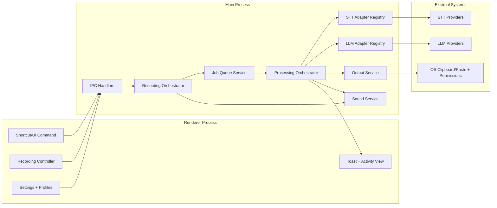
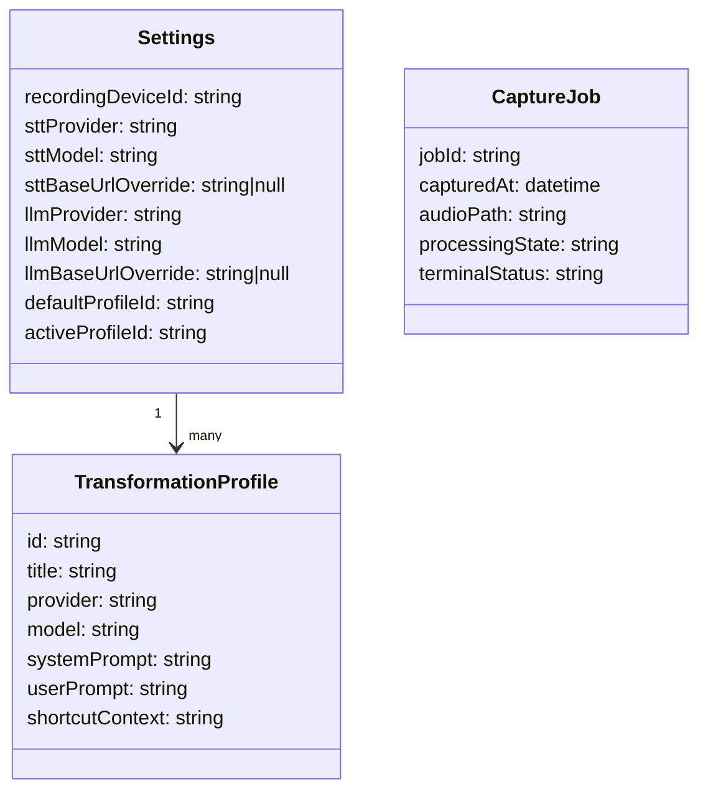
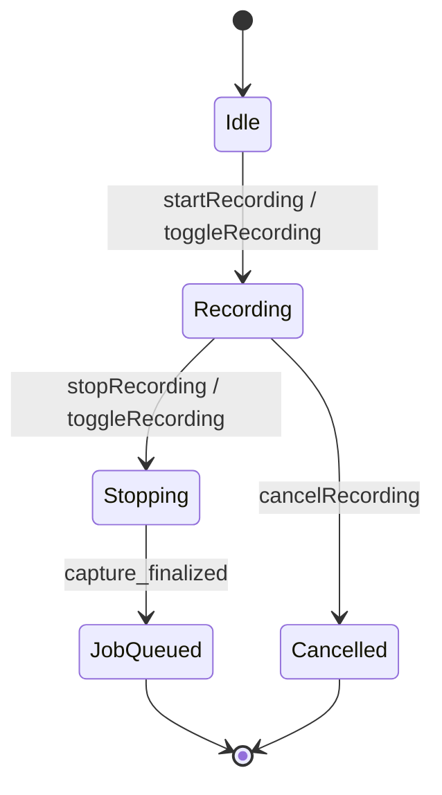
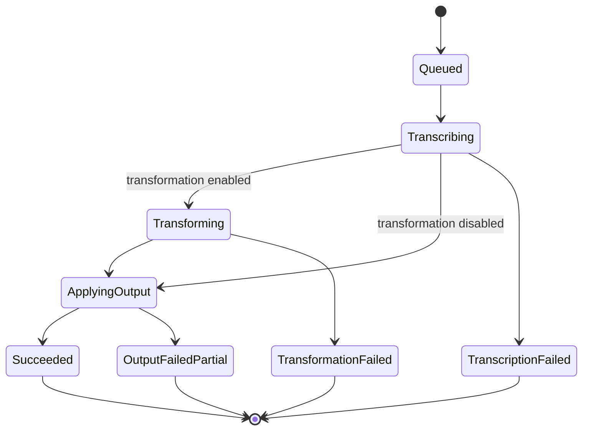
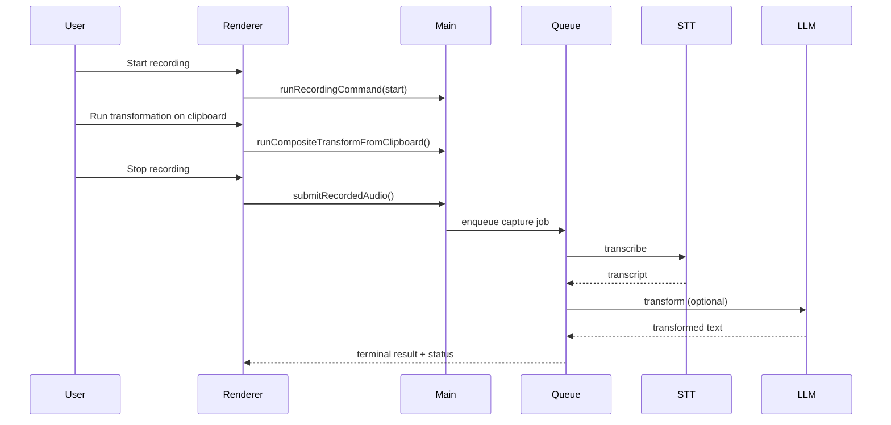
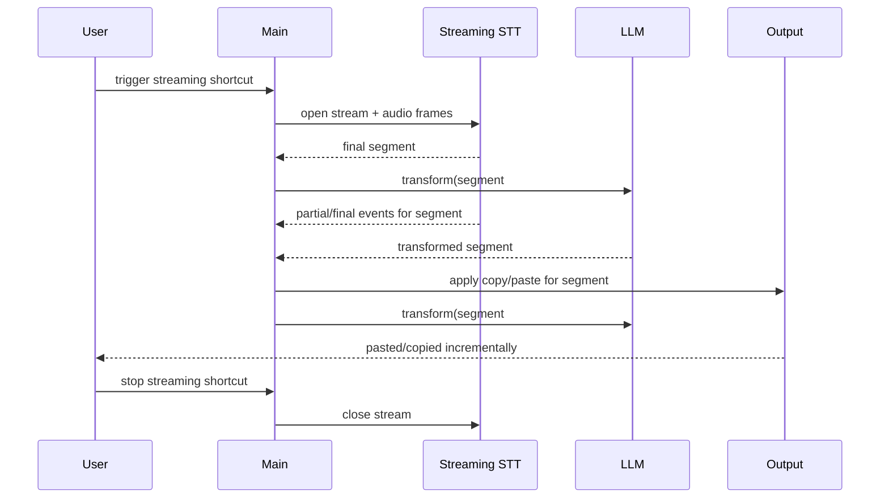

<!--
Where: specs/v1-spec.md
What: Normative v1 implementation specification for the Speech-to-Text app.
Why: Define mandatory behavior and interfaces for delivery, testing, and review.
-->

# Speech-to-Text App v1 Normative Specification

## 1. Scope

This document is the **normative** specification for v1.

It defines:
- Functional behavior.
- Runtime architecture constraints.
- Adapter models for STT and LLM APIs.
- Transformation profile scheme.
- Concurrency and non-blocking guarantees.
- Required user notifications and acceptance criteria.

Out of scope for v1:
- Voice-activated recording.
- Real-time streaming transcription/agent behavior.
- Non-macOS runtime targets.
- Enterprise governance/compliance features.

## 2. Terminology and Normative Language

### 2.1 Normative keywords

The key words **MUST**, **SHOULD**, and **MAY** in this document are to be interpreted as requirement levels:
- **MUST**: mandatory requirement.
- **SHOULD**: recommended unless a justified exception exists.
- **MAY**: optional behavior.

### 2.2 Terms

- **Capture**: an audio segment produced by `start/stop` or `toggle` recording commands.
- **Job**: one processing unit derived from one completed capture.
- **Stream segment**: one incremental finalized text unit produced during a real-time session.
- **Terminal status**: one final result state for a job.
- **STT adapter**: provider-specific implementation that produces normalized transcript output.
- **LLM adapter**: provider-specific implementation that produces normalized transformed output.
- **Transformation profile**: named transformation configuration (title, provider, model, prompts, shortcut metadata).

## 3. System Model

### 3.1 Product model

The app is an Electron-based macOS utility that:
1. Captures speech audio.
2. Sends audio to selected STT provider/model.
3. Optionally applies LLM transformation.
4. Applies output actions (clipboard/paste).

### 3.2 Required capability model

v1 **MUST** support:
- Multiple STT APIs via adapters.
- Multiple LLM APIs via adapters.
- Multiple transformation profiles.
- Global shortcuts.
- Audio device detection.
- Sound notifications for recording and transformation completion.
- Non-blocking user actions across recording/transformation/transcription.

### 3.3 Architecture overview



## 4. Functional Requirements

### 4.1 Recording commands

The system **MUST** support these global and UI-triggerable recording commands:
- `startRecording`
- `stopRecording`
- `toggleRecording`
- `cancelRecording`

Behavior:
- `startRecording` **MUST** fail with actionable error when microphone access is unavailable.
- `stopRecording` **MUST** finalize the current capture into exactly one job.
- `cancelRecording` **MUST** stop active capture and **MUST NOT** enqueue a processing job.
- `toggleRecording` **MUST** start if idle and stop if recording.

### 4.2 Global shortcuts

- Shortcuts **MUST** be configurable by user settings.
- The app **MUST** support changing global shortcut keybinds from Settings.
- Changed keybinds **MUST** persist across app restart/login.
- Changed keybinds **MUST** be re-registered and applied without requiring app restart.
- Shortcut registration **MUST** happen in main process.
- Shortcut execution **MUST** remain active after login auto-start.
- Recording commands (`startRecording`, `stopRecording`, `toggleRecording`, `cancelRecording`) **MUST** each have global shortcut bindings.
- Invalid shortcut strings **SHOULD** be rejected with user-visible feedback.
- Conflicting keybinds **SHOULD** be rejected with actionable validation feedback.
- If global shortcut registration fails at runtime, the app **MUST** show actionable user feedback and **MUST** keep UI command execution available.
- Transformation shortcuts **MUST** be common across profiles (not profile-specific).
- The system **MUST** provide these transformation-related shortcuts:
  - Run default transformation profile against top item in clipboard.
  - Pick active transformation profile and run against top item in clipboard.
  - Change default transformation profile.
  - Run transformation against cursor-selected text.

### 4.3 Sound notifications

The app **MUST** play notification sounds for:
- Recording started.
- Recording stopped.
- Recording cancelled.
- Transformation finished (success or failure).

Additional notes:
- Distinct tones **SHOULD** be used for success vs failure.
- Sound volume selection **MAY** be user-configurable.

### 4.4 Audio device detection

- The app **MUST** detect available audio input devices.
- The app **MUST** provide a system default device option.
- If multiple devices are available, the user **MUST** be able to select one.
- If selected device becomes unavailable, capture **MUST** fall back to system default with warning.

### 4.5 Non-blocking interaction model

The app **MUST NOT** block user actions while asynchronous processing runs.

Required concurrent behavior:
- While recording, user **MUST** be able to run transformation actions.
- While transcription request is in flight, user **MUST** be able to start/stop/cancel next recording.
- While transformation request is in flight, recording commands **MUST** still respond.

Queue guarantees:
- Every completed capture **MUST** map to exactly one job.
- Completed captures **MUST NOT** be dropped during back-to-back operations.
- Finalizing a capture **MUST** enqueue the job and **MUST** automatically start processing (STT, then optional transformation) without extra user action.

## 5. STT API Adapter Model

### 5.1 STT adapter contract

Each STT adapter **MUST** implement:
- `providerId` (stable string key).
- `supportedModels` (allowlist).
- `transcribe(input)` -> normalized transcription result or typed failure.

Input contract:
- `audioFilePath` or binary payload reference.
- `model`.
- `apiKeyRef`.
- Optional `baseUrlOverride`.
- Optional language and temperature controls.

Output contract:
- `text` (string).
- `provider`.
- `model`.
- Optional metadata (duration, confidence segments).

### 5.2 STT provider requirements

v1 **MUST** support at least these STT providers:
- Groq (Whisper-compatible endpoint).
- ElevenLabs (speech-to-text endpoint).

Rules:
- User **MUST** pre-configure STT provider in Settings before recording/transcription execution.
- User **MUST** pre-configure STT model in Settings before recording/transcription execution.
- The app **MUST NOT** automatically choose or switch STT provider/model when configuration is missing.
- If STT provider is unset, the app **MUST** show actionable error and **MUST NOT** start STT request.
- If STT model is unset, the app **MUST** show actionable error and **MUST NOT** start STT request.
- API key configuration for each STT provider **MUST** be available in Settings and **MUST** be persisted securely.
- STT provider configuration **MUST** support optional base URL override in Settings.
- STT base URL override **MUST** be stored in `settings.stt.baseUrlOverride`.
- When STT base URL override is set, STT requests **MUST** use the override instead of provider default endpoint.
- STT request execution **MUST** be blocked when required STT API key is missing or invalid, and the app **MUST** show actionable error.
- Unsupported model/provider combinations **MUST** be rejected before network call.
- API authentication failures **MUST** emit explicit user-facing error.
- Provider switching **MAY** be user-selected in settings, but automatic failover **MUST NOT** occur silently.

## 6. LLM API Adapter Model

### 6.1 LLM adapter contract

Each LLM adapter **MUST** implement:
- `providerId`.
- `supportedModels`.
- `transform(input)` -> normalized transformed output or typed failure.

Input contract:
- `text` (source transcript or clipboard text).
- `model`.
- `apiKeyRef`.
- Optional `baseUrlOverride`.
- `systemPrompt` and `userPrompt`.

Output contract:
- `text` (transformed output).
- `provider`.
- `model`.

### 6.2 LLM provider requirements

v1 **MUST** support multiple LLM providers at architecture level through adapters.

Implementation note:
- v1 deployment **MAY** enable a limited provider/model allowlist, but the adapter abstraction **MUST** remain multi-provider capable.
- For current v1 UI, Google **MUST** be the only exposed LLM provider option.
- Additional LLM providers **MAY** be implemented behind adapter interfaces without being exposed in v1 UI.
- API key configuration for each implemented LLM provider **MUST** be available in Settings and **MUST** be persisted securely.
- LLM provider configuration **MUST** support optional base URL override in Settings.
- LLM base URL override **MUST** be stored in `settings.llm.baseUrlOverride`.
- When LLM base URL override is set, LLM requests **MUST** use the override instead of provider default endpoint.
- LLM request execution **MUST** be blocked when required LLM API key is missing or invalid, and the app **MUST** show actionable error.

Failure behavior:
- Transformation failure **MUST** keep original transcript available.
- Transformation failure **MUST** produce explicit terminal status.

## 7. Transformation Scheme

### 7.1 Multi-profile requirement

The app **MUST** support multiple transformation profiles.

Each profile **MUST** include:
- `id` (stable unique key).
- `title` (user-visible name).
- `provider`.
- `model`.
- `systemPrompt`.
- `userPrompt`.
- `shortcutContext` metadata used by shared transformation shortcuts to identify active/default profile targeting semantics.

Additional rules:
- Exactly one default profile **MUST** exist.
- One active profile **MUST** be selectable independently from default.
- Profile edits **MUST** persist across app restart.

### 7.2 Transformation data schema

```yaml
settings:
  stt:
    provider: "groq"
    model: "whisper-large-v3-turbo"
    baseUrlOverride: null
  llm:
    provider: "google"
    model: "gemini-1.5-flash-8b"
    baseUrlOverride: null

transformationProfiles:
  defaultProfileId: "default"
  activeProfileId: "default"
  profiles:
    - id: "default"
      title: "Default Rewrite"
      provider: "google"
      model: "gemini-1.5-flash-8b"
      systemPrompt: ""
      userPrompt: "{{input}}"
      shortcutContext: "default-target"
```

### 7.3 Data model diagram



## 8. Lifecycle and Concurrency

### 8.1 Recording lifecycle



### 8.2 Processing lifecycle



### 8.3 Non-blocking execution sequence



## 9. Error Handling and Observability

- Every failed operation **MUST** emit actionable user feedback.
- The app **MUST** show toast notifications for:
  - command start/stop/cancel outcomes
  - transformation completion outcomes
  - validation and network/API failures
- Terminal statuses **MUST** be one of:
  - `succeeded`
  - `capture_failed`
  - `transcription_failed`
  - `transformation_failed`
  - `output_failed_partial`
- Network failures **SHOULD** include provider endpoint context.

## 10. Conformance and Test Requirements

### 10.1 Required automated tests

The test suite **MUST** include:
1. Multiple transformation profile CRUD + default/active enforcement.
2. STT adapter allowlist rejection behavior.
3. LLM adapter allowlist rejection behavior.
4. Global shortcut dispatch for recording commands.
5. Sound notification trigger tests for:
   - recording start
   - recording stop
   - recording cancel
   - transformation completion
6. Audio device discovery with multiple device options.
7. Back-to-back capture reliability without dropped jobs.
8. Non-blocking behavior tests proving recording commands remain available while transcription/transformation is running.
9. Transformation shortcut behavior tests:
   - run default profile on clipboard top item
   - pick-and-run profile on clipboard top item
   - change default profile
   - run transformation against cursor-selected text
10. STT pre-configuration validation tests:
   - unset STT provider blocks STT execution with explicit user-facing error
   - unset STT model blocks STT execution with explicit user-facing error
11. Provider API key validation tests:
   - missing/invalid STT provider key blocks transcription request with explicit error
   - missing/invalid LLM key blocks transformation request with explicit error
12. Base URL override routing tests:
   - STT adapter uses configured base URL override when set
   - LLM adapter uses configured base URL override when set
13. Capture finalization automation test:
   - finalized capture enqueues and automatically starts STT processing without extra user action

### 10.2 Manual verification checklist

- User can select between at least two STT providers in settings.
- If STT provider or model is unset, UI shows explicit actionable error and no STT request is attempted.
- LLM UI exposes Google only in v1 while adapter architecture remains multi-provider capable.
- User can create/edit/select multiple transformation profiles.
- Start/stop/cancel sounds are audible.
- Transformation completion sound is audible for both success and failure.
- UI remains responsive during active processing.

## 11. Gap Closure vs Existing Docs

This spec closes these gaps from prior draft docs:
- Explicit normative language and requirement strength.
- Multi-provider adapter model requirements for both STT and LLM.
- Multiple transformation profile schema with required fields (`title`, `provider`, `model`, prompts).
- Mandatory non-blocking concurrency behavior.
- Mandatory recording/transformation sound notifications.
- Explicit architecture/data/lifecycle diagrams.

## 12. Forward Compatibility (Out of v1 Scope)

This section defines architecture constraints for future updates. It does not change v1 scope.

### 12.1 Future real-time streaming capability

Real-time streaming transcription remains out of scope for v1, but architecture **MUST** remain extensible to support:
- macOS Tahoe `SpeechAnalyzer`/`SpeechTranscriber` APIs.
- OpenAI real-time speech-to-text APIs.
- incremental transform + output application while streaming continues.

### 12.2 Future streaming provider model

Future versions **MUST** treat real-time STT as provider adapters behind a shared contract.

Required future adapter inputs:
- session audio stream reference.
- provider/model.
- `apiKeyRef` when required by provider.
- optional `baseUrlOverride`.
- stream/session options (language, chunk policy, VAD/finalization policy).

Required future adapter outputs:
- ordered stream events with monotonic `sequence`.
- event `kind` (`partial`, `final`, `error`, `end`).
- text payload for `partial`/`final`.

### 12.3 Future streaming execution model

When user triggers the assigned global shortcut in a streaming mode:
- app **MUST** start one streaming session.
- app **MUST** continue recording/transcribing until user ends session or provider closes stream.
- each finalized stream segment **MUST** be eligible for transformation independently.
- transformation for segment `N` **MUST NOT** block transcription of segment `N+1`.
- output actions for segment `N` (copy/paste) **MUST** follow configured output policy and **MUST** preserve segment order.
- if one segment transformation fails, app **MUST** continue processing subsequent segments and emit actionable feedback.
- segment delimiter/join policy for incremental paste **MUST** be explicitly configurable in future versions; default behavior is **TBD** in this spec revision.

### 12.4 Future streaming architecture diagram


### 12.5 Future streaming sequence example



### 12.6 Future streaming safeguards

To keep non-blocking behavior consistent with section 4.5, future streaming mode **SHOULD**:
- isolate capture/transcription from transformation/output via internal queues.
- cap in-flight transformations to prevent unbounded memory growth.
- expose per-segment status in activity/toast UI.
- keep recording command handling responsive while segment transforms are in flight.

## 13. Decision Log (Resolved)

1. v1 UI exposes Google only for LLM selection, while architecture remains multi-provider capable.
2. Transformation completion sound plays on both success and failure.
3. Transformation shortcuts are common across profiles and include:
   - run default profile on clipboard top item
   - pick-and-run profile on clipboard top item
   - change default profile
   - run transformation against cursor-selected text
